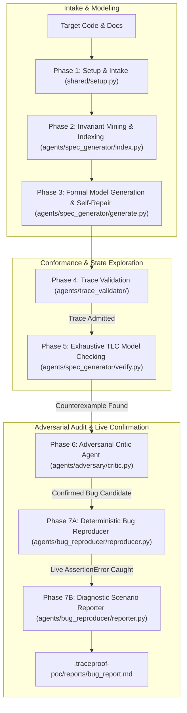
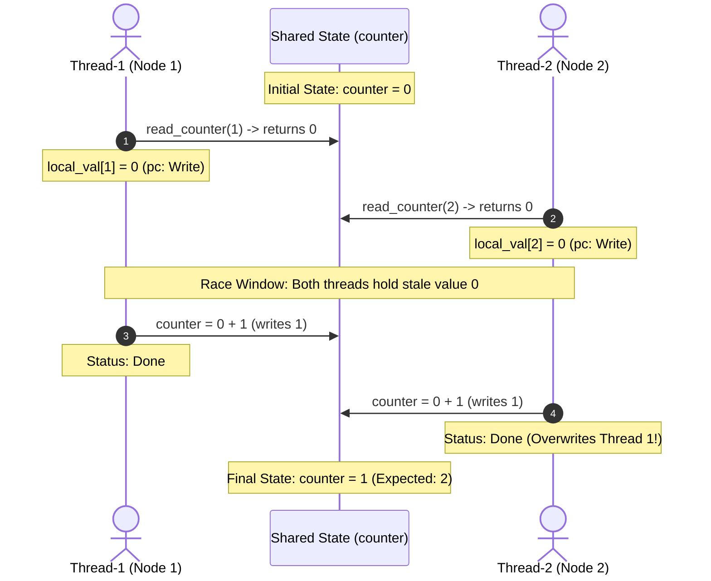

# TraceProof: Autonomous Formal Verification & Bug Reproduction Pipeline

---

## Table of Contents
1. [High-Level Architecture](#1-high-level-architecture)
2. [The 7 Pipeline Stages](#2-the-7-pipeline-stages)
3. [Project Directory Layout](#3-project-directory-layout)
4. [Prerequisites & Environment Setup](#4-prerequisites--environment-setup)
5. [Quickstart Guide](#5-quickstart-guide)
6. [CLI Reference](#6-cli-reference)
7. [Concrete Walkthrough: Distributed Counter](#7-concrete-walkthrough-distributed-counter)
8. [Artifacts & Verification Provenance](#8-artifacts--verification-provenance)
9. [Design Philosophy & Scope Boundary](#9-design-philosophy--scope-boundary)

---

## 1. High-Level Architecture



---

## 2. The 7 Pipeline Stages

### Phase 1: Run Intake & Configuration (`shared/setup.py`)
- Ingests source files, documentation, and configuration flags.
- Validates LLM provider connectivity (Gemini, Anthropic, OpenAI, etc.).
- Initializes workspace state and writes `.traceproof-poc/run-config.md`.

### Phase 2: Invariant Mining & Code Indexing (`agents/spec_generator/index.py`)
- Analyzes target source code using AST parsing and static analysis.
- Extracts concurrency properties: shared variables, lock primitives, critical sections, and candidate invariants (e.g., `NoLostUpdates`, `MutualExclusion`).
- Writes structured knowledge cache to `.traceproof-poc/knowledge/`.

### Phase 3: Model Generation & Syntax Self-Repair (`agents/spec_generator/generate.py`)
- Drafts a formal TLA+/PlusCal specification from mined knowledge.
- **Capped Self-Repair Gate**: Connects to `tla-mcp` via JSON-RPC to run `validate_spec`. If syntax or parsing errors occur, the LLM iteratively repairs the specification (up to a configurable cap).
- Emits clean model files: `.traceproof-poc/model/base.tla` and `base.cfg`.

### Phase 4: Trace Validation / Model-Code Conformance (`agents/trace_validator/`)
- **Crucial Conformance Gate**: Before exploring states, TraceProof guarantees that the model reflects the actual system.
- Executes the Python target with lightweight instrumentation (`tracer.py`) to harvest real execution event traces (`Read`, `Write`).
- Feeds the trace into `tla-mcp` via `replay_scenario` (`validator.py`). If the model rejects the trace, the pipeline halts—preventing model checking on a hallucinated model.
- Emits `.traceproof-poc/validation/trace-validation.md`.

### Phase 5: Exhaustive Model Checking (`agents/spec_generator/verify.py`)
- Communicates with `/usr/local/bin/tla-mcp` using standard Model Context Protocol (JSON-RPC 2.0 stdio).
- Runs `check_spec` (TLC model checker) up to configured state, depth, and time limits.
- Systematically explores all possible thread interleavings to find invariant violations.
- When an invariant fails, extracts the minimal state-by-state counterexample trace into `.traceproof-poc/export/manifest.md`.

### Phase 6: Adversarial Critic Agent (`agents/adversary/critic.py`)
- An independent LLM agent acts as a skeptical adversary to challenge the counterexample:
  1. **Invariant Soundness**: Is the invariant a real business/safety requirement, or an overly restrictive constraint?
  2. **Model Fidelity**: Does the TLA+ spec accurately represent the code, or is the counterexample an artifact of model over-simplification?
  3. **Interleaving Feasibility**: Can the operating system thread scheduler actually produce this schedule under standard preemption?
- Generates a confidence score and verdict (`CONFIRMED_BUG_CANDIDATE` or `FALSE_INVARIANT_ALERT`) at `.traceproof-poc/adversary/adversary-report.md`.

### Phase 7: Bug Confirmation & Diagnostic Scenario Delivery (`agents/bug_reproducer/`)
- **Deterministic Replay (`reproducer.py`)**: Translates the abstract TLA+ state schedule into a deterministic Python test script using synchronization primitives (`threading.Barrier(2)`).
  - Forces Thread 1 and Thread 2 to read the initial value simultaneously before either writes back.
  - Executes against the live target: catches `AssertionError: Lost update confirmed: counter=1, expected=2`.
  - Proves the bug exists on the real machine with **zero false positives**.
- **Diagnostic Scenario Report (`reporter.py`)**: Compiles all pipeline evidence into an executive-ready Markdown report at `.traceproof-poc/reports/bug_report.md` formatted in Egypt Time (`UTC+3`) with Mermaid sequence diagrams, state tables, and the exact interleaving scenario.

---

## 3. Project Directory Layout

```text
PoC/
├── run.sh                          # Master automated execution script
├── cli.py                          # Unified CLI entry point
├── shared/                         # Core models, schemas, and LLM clients
│   ├── client.py                   # Provider-agnostic LLM interface (Gemini/Anthropic/OpenAI)
│   ├── schemas.py                  # Pydantic schemas for configs and manifests
│   └── setup.py                    # Phase 1 runner & options discovery
├── agents/
│   ├── spec_generator/             # Phases 2, 3, & 5
│   │   ├── index.py                # Invariant mining & AST indexing
│   │   ├── generate.py             # TLA+ model generation & repair loop
│   │   └── verify.py               # MCP JSON-RPC client for tla-mcp (TLC)
│   ├── trace_validator/            # Phase 4
│   │   ├── tracer.py               # Runtime event trace harvester
│   │   └── validator.py            # replay_scenario conformance validator
│   ├── adversary/                  # Phase 6
│   │   └── critic.py               # Adversarial Refinement Critic Agent
│   └── bug_reproducer/             # Phase 7
│       ├── reproducer.py           # Deterministic barrier-based live replay
│       └── reporter.py             # Diagnostic report generator
├── examples/
│   └── dist_counter/               # Demo target codebase
│       ├── counter.py              # Buggy distributed counter with race condition
│       └── README.md
└── .traceproof-poc/                # Pipeline run artifacts (auto-generated)
    ├── run-config.md               # Run metadata & settings
    ├── knowledge/                  # Mined AST symbols & invariants
    ├── model/                      # Generated TLA+ specs (base.tla, base.cfg)
    ├── validation/                 # Trace validation conformance reports
    ├── export/                     # TLC counterexample manifest (manifest.md)
    ├── adversary/                  # Adversary critique & confidence assessment
    ├── reproduction/               # Generated test harness & execution telemetry
    └── reports/                    # Final executive diagnostic report (bug_report.md)
```

---

## 4. Prerequisites & Environment Setup

### 1. Python Environment
Python 3.10+ is required:
```bash
python3 -m venv .venv
source .venv/bin/activate
pip install -r requirements.txt
```

### 2. TLA-RS Model Context Protocol Binary (`tla-mcp`)
TraceProof interfaces with TLA+ via `tla-mcp`. Verify installation:
```bash
which tla-mcp
# Expected: /usr/local/bin/tla-mcp
```

### 3. LLM API Key
Set your API key for your chosen provider (e.g. Gemini):
```bash
export TRACEPROOF_API_KEY="your-api-key-here"
# or
export GEMINI_API_KEY="your-api-key-here"
```

---

## 5. Quickstart Guide

To execute the entire 7-stage pipeline in one automated sweep:

```bash
./run.sh
```

### What happens during `./run.sh`:
1. Initializes configuration.
2. Mines invariants and indexes `examples/dist_counter/counter.py`.
3. Synthesizes `base.tla` and validates syntax against `tla-mcp`.
4. Runs live trace harvesting and confirms model conformance via `replay_scenario`.
5. Runs TLC model checker: detects lost update and outputs counterexample.
6. Launches Adversarial Critic: validates invariant soundness and thread interleaving feasibility.
7. Synthesizes deterministic reproduction test, executes it, catches `AssertionError`, and generates `.traceproof-poc/reports/bug_report.md`.

---

## 6. CLI Reference

Individual phases can be executed modularly via `cli.py`:

| Subcommand | Description | Example Command |
|---|---|---|
| `run` | Phase 1: Initialize run & write configuration | `python3 cli.py run --source examples/dist_counter --provider gemini` |
| `index` | Phase 2: Mine invariants & AST knowledge | `python3 cli.py index --out .traceproof-poc` |
| `generate` | Phase 3: Synthesize & repair TLA+ model | `python3 cli.py generate --out .traceproof-poc` |
| `trace-validate` | Phase 4: Validate model-code conformance | `python3 cli.py trace-validate --source examples/dist_counter/counter.py` |
| `verify` | Phase 5: Run TLC model checker via MCP | `python3 cli.py verify --out .traceproof-poc` |
| `adversary` | Phase 6: Run Adversarial Critic Agent | `python3 cli.py adversary --source examples/dist_counter/counter.py` |
| `reproduce` | Phase 7: Deterministic replay & report | `python3 cli.py reproduce --source examples/dist_counter/counter.py` |

---

## 7. Concrete Walkthrough: Distributed Counter

### The Target Code (`examples/dist_counter/counter.py`)
```python
def increment(node_id: int) -> None:
    global counter
    val = read_counter(node_id)   # Step 1: Read shared counter
    time.sleep(0.001)             # Step 2: Processing delay (widens race window)
    counter = val + 1             # Step 3: Write back without holding a lock
```

### The Invariant
$$\text{NoLostUpdates} \triangleq \text{counter} = \text{total increments completed}$$

### The Failure Schedule Discovered by TLC
The TLC model checker discovers that concurrent nodes can interleave:
1. **Thread 1** executes `read_counter()` $\rightarrow$ reads `0`, stores `local_val[1] = 0`.
2. **Thread 2** executes `read_counter()` $\rightarrow$ reads `0`, stores `local_val[2] = 0` *(critical race)*.
3. **Thread 1** computes $0 + 1$ and writes `counter = 1`.
4. **Thread 2** computes $0 + 1$ and writes `counter = 1` *(overwrites Thread 1's update)*.
5. **Violation**: Both threads completed, but `counter = 1` instead of `2`.



### Live Reproduction Proof
The Bug Confirmation Agent synthesizes a test with `threading.Barrier(2)` to lock this interleaving into place deterministically:
```text
AssertionError: Lost update bug confirmed! Final counter=1, expected=2. 
Both nodes read initial value 0 concurrently before either wrote back.
```

---

## 8. Artifacts & Verification Provenance

Every run generates an auditable paper trail inside `.traceproof-poc/`:

| Artifact | Path | Description |
|---|---|---|
| **Run Config** | `.traceproof-poc/run-config.md` | Snapshot of run parameters, provider, and source paths |
| **Knowledge Index** | `.traceproof-poc/knowledge/_index.md` | Extracted AST symbols, functions, and mined invariants |
| **Formal Spec** | `.traceproof-poc/model/base.tla` | Validated TLA+ specification representing the code |
| **Trace Conformance** | `.traceproof-poc/validation/trace-validation.md` | `replay_scenario` proof that model admits real code traces |
| **Counterexample** | `.traceproof-poc/export/manifest.md` | State-by-state trace from TLC proving invariant violation |
| **Adversary Critique** | `.traceproof-poc/adversary/adversary-report.md` | LLM critic review of invariant soundness & preemption feasibility |
| **Replay Script** | `.traceproof-poc/reproduction/test_reproduce_bug.py` | Auto-generated deterministic reproduction script |
| **Replay Result** | `.traceproof-poc/reproduction/reproduction_result.json` | Execution telemetry and captured assertion failure |
| **Diagnostic Report** | `.traceproof-poc/reports/bug_report.md` | Complete executive diagnostic report for developers and mentors |

---

## 9. Design Philosophy & Scope Boundary

1. **Detection & Scenario Delivery, Not Auto-Patching**:  
   TraceProof is designed to detect deep concurrency flaws and deliver the exact physical execution scenario required to trigger them. Remediation and architectural locking decisions remain with the software engineers who understand product trade-offs.
2. **Deterministic Empirical Grounding**:  
   A formal counterexample is only considered a bug once it has been deterministically replayed on the real runtime. This eliminates false alarms from model over-abstraction.
3. **Non-Invasive Verification**:  
   TraceProof never modifies the target source code. All trace harvesting and test harnesses are external and non-invasive.
