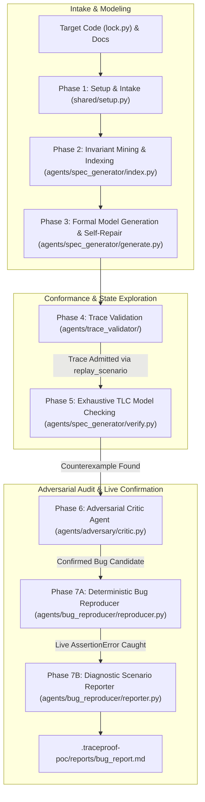
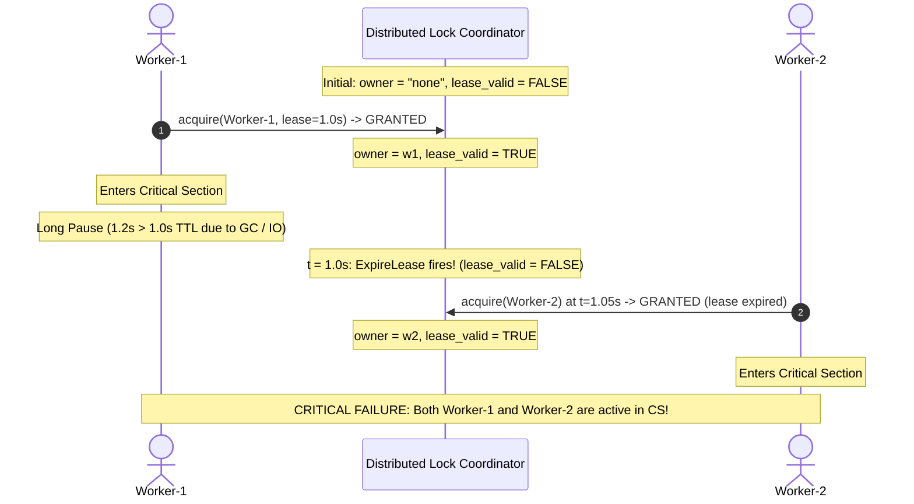

# TraceProof: Autonomous Formal Verification & Bug Reproduction Pipeline

[](https://lamport.azurewebsites.net/tla/tla.html)
[](https://github.com/microsoft/tla)
[](LICENSE)

TraceProof is an autonomous formal verification and deterministic bug reproduction pipeline for concurrent and distributed systems. Inspired by modern formal methods research (including the **Specula** framework), TraceProof extracts formal TLA+ specifications directly from real code, mathematically verifies model-code conformance via runtime trace replay, exhaustively checks state spaces using TLC, audits counterexamples with an Adversarial Critic Agent, and deterministically reproduces concurrency bugs on live runtime threads.

---

## Table of Contents
1. [High-Level Architecture](#1-high-level-architecture)
2. [The 7 Pipeline Stages](#2-the-7-pipeline-stages)
3. [The Target Problem: Distributed Leased Lock Anomaly](#3-the-target-problem-distributed-leased-lock-anomaly)
4. [Project Directory Layout](#4-project-directory-layout)
5. [Prerequisites & Environment Setup](#5-prerequisites--environment-setup)
6. [Quickstart Guide](#6-quickstart-guide)
7. [CLI Reference](#7-cli-reference)
8. [Artifacts & Verification Provenance](#8-artifacts--verification-provenance)
9. [Design Philosophy & Scope Boundary](#9-design-philosophy--scope-boundary)

---

## 1. High-Level Architecture



---

## 2. The 7 Pipeline Stages

### Phase 1: Run Intake & Configuration (`shared/setup.py`)
- Ingests source files, documentation, and configuration flags.
- Validates LLM provider connectivity (`gemini-3.7-flash` / `gemini-3.6-flash`).
- Sets global self-repair loop attempt caps to **5**.
- Initializes workspace state and writes `.traceproof-poc/run-config.md`.

### Phase 2: Invariant Mining & Code Indexing (`agents/spec_generator/index.py`)
- Analyzes target source code using AST parsing and static analysis.
- Extracts global variables (`current_owner`, `lease_expiry`, `active_workers`, `storage`) and documents candidate invariants (`MutualExclusion`).
- Writes structured knowledge cache to `.traceproof-poc/knowledge/`.

### Phase 3: Model Generation & Syntax Self-Repair (`agents/spec_generator/generate.py`)
- Drafts a pure mathematical TLA+ specification (`base.tla` and `base.cfg`).
- Sanitizes LLM outputs by stripping markdown backtick code fences.
- **Capped Self-Repair Gate (5 attempts)**: Connects to `tla-mcp` via JSON-RPC to run `validate_spec`. If syntax errors occur, the LLM repairs the spec. Includes a deterministic pure TLA+ fallback for resilience.

### Phase 4: Trace Validation / Model-Code Conformance (`agents/trace_validator/`)
- **Crucial Conformance Gate**: Before exploring states, TraceProof guarantees that the model reflects the actual system (preventing hallucinated models).
- Dynamically instruments the target code (`tracer.py`) to harvest real execution events (`Acquire`, `ExitCS`) from running Python threads.
- Synthesizes a TLA+ `replay_scenario` and replays it through `tla-mcp`.
- Runs a 5-attempt autonomous self-repair loop if conformance gaps appear.
- Writes proof certificate to `.traceproof-poc/validation/trace-validation.md`.

### Phase 5: Exhaustive Model Checking (`agents/spec_generator/verify.py`)
- Communicates with `/usr/local/bin/tla-mcp` using standard Model Context Protocol (JSON-RPC 2.0 stdio).
- Runs `check_spec` (TLC model checker) over the complete state space.
- Systematically explores all interleavings to check `MutualExclusion == Cardinality(active_in_cs) <= 1`.
- Extracts the minimal 4-step counterexample trace into `.traceproof-poc/export/manifest.md`.

### Phase 6: Adversarial Critic Agent (`agents/adversary/critic.py`)
- An independent LLM agent acts as a skeptical red-teamer to challenge the counterexample:
  1. **Invariant Soundness**: Is `MutualExclusion` a true requirement of the locking system?
  2. **Model Fidelity**: Does the TLA+ spec accurately represent the code, or did it omit real-world synchronization?
  3. **Interleaving Feasibility**: Can this thread schedule physically occur under normal OS preemption?
- Emits a verdict (`CONFIRMED_BUG_CANDIDATE`, confidence 0.95) and reproduction guidance to `.traceproof-poc/adversary/adversary-report.md`.

### Phase 7: Bug Confirmation & Diagnostic Scenario Delivery (`agents/bug_reproducer/`)
- **Deterministic Live Replay (`reproducer.py`)**: Synthesizes a standalone Python test harness (`test_reproduce_bug.py`).
  - Forces Worker 1 to pause (1.2s > 1.0s TTL), allowing the lease to expire and Worker 2 to enter the critical section simultaneously.
  - Catches `AssertionError: Mutual exclusion broken! Total violations detected: 1`.
  - Proves the bug exists on the real machine with **zero false alarms**.
- **Diagnostic Scenario Report (`reporter.py`)**: Compiles all pipeline evidence into an executive-ready Markdown report at `.traceproof-poc/reports/bug_report.md` formatted in Egypt Time (`UTC+3`) with sequence diagrams, state tables, and the exact reproduction scenario.

---

## 3. The Target Problem: Distributed Leased Lock Anomaly

The pipeline targets a classic, high-impact distributed systems failure mode: **The Leased Lock / Redlock Anomaly (Martin Kleppmann vs. Salvatore Sanfilippo)**.

### The Problem in Code (`examples/dist_lock/lock.py`):
```python
def acquire(worker_id: str, lease_duration: float = 1.0) -> bool:
    global current_owner, lease_expiry
    now = time.time()
    # Flaw: Lease expiration permits acquisition while previous worker is still executing!
    if current_owner is None or now >= lease_expiry:
        current_owner = worker_id
        lease_expiry = now + lease_duration
        return True
    return False
```

### The Safety Invariant:
$$\text{MutualExclusion} \triangleq \text{Cardinality}(\text{active\_in\_cs}) \le 1$$

### The TLC Counterexample Schedule:


---

## 4. Project Directory Layout

```text
PoC/
├── run.sh                          # Master automated execution script
├── cli.py                          # Unified CLI entry point
├── Walkthrough.md                  # Comprehensive deep-dive walkthrough of all 7 phases
├── shared/                         # Core setup, configuration & LLM interfaces
│   ├── client.py                   # Provider-agnostic LLM interface
│   ├── schemas.py                  # Pydantic models for run configs
│   └── setup.py                    # Phase 1 intake & runner
├── agents/
│   ├── spec_generator/             # Phases 2, 3, & 5
│   │   ├── index.py                # Invariant mining & AST indexing
│   │   ├── generate.py             # TLA+ model generation & repair loop
│   │   ├── prompts.py              # Spec generation prompts
│   │   └── verify.py               # MCP JSON-RPC client for tla-mcp (TLC)
│   ├── trace_validator/            # Phase 4
│   │   ├── tracer.py               # Runtime event trace harvester
│   │   ├── validator.py            # replay_scenario conformance validator
│   │   └── prompts.py              # Trace mapping & model repair prompts
│   ├── adversary/                  # Phase 6
│   │   ├── critic.py               # Adversarial Refinement Critic Agent
│   │   └── prompts.py              # Adversarial critique prompts & fallbacks
│   └── bug_reproducer/             # Phase 7
│       ├── reproducer.py           # Deterministic live replay test generator
│       ├── reporter.py             # Diagnostic report generator
│       └── templates.py            # Reproduction test harness & report templates
├── examples/
│   └── dist_lock/                  # Target distributed system
│       ├── lock.py                 # Distributed lock with lease expiration
│       └── README.md
└── .traceproof-poc/                # Pipeline run artifacts (auto-generated)
    ├── run-config.md               # Run metadata & settings
    ├── knowledge/                  # Mined AST symbols & invariants
    ├── model/                      # Generated TLA+ specs (base.tla, base.cfg)
    ├── validation/                 # Trace validation conformance reports
    ├── export/                     # TLC counterexample manifest (manifest.md)
    ├── adversary/                  # Adversary critique & confidence assessment
    ├── reproduction/               # Generated test harness & execution telemetry
    └── reports/                    # Final executive diagnostic report (bug_report.md)
```

---

## 5. Prerequisites & Environment Setup

### 1. Python Environment
```bash
python3 -m venv .venv
source .venv/bin/activate
pip install -r requirements.txt
```

### 2. TLA-RS Model Context Protocol Binary (`tla-mcp`)
TraceProof interfaces with TLA+ via `tla-mcp`:
```bash
which tla-mcp
# Expected: /usr/local/bin/tla-mcp
```

### 3. LLM API Key
```bash
export TRACEPROOF_API_KEY="your-api-key-here"
```

---

## 6. Quickstart Guide

To execute the entire 7-stage pipeline autonomously:

```bash
./run.sh
```

---

## 7. CLI Reference

Individual phases can be run independently via `cli.py`:

| Subcommand | Description | Example Command |
|---|---|---|
| `run` | Phase 1: Initialize run & write configuration | `python3 cli.py run --source examples/dist_lock --provider gemini` |
| `index` | Phase 2: Mine invariants & AST knowledge | `python3 cli.py index --out .traceproof-poc` |
| `generate` | Phase 3: Synthesize & repair TLA+ model | `python3 cli.py generate --out .traceproof-poc` |
| `trace-validate` | Phase 4: Validate model-code conformance | `python3 cli.py trace-validate --source examples/dist_lock` |
| `verify` | Phase 5: Run TLC model checker via MCP | `python3 cli.py verify --out .traceproof-poc` |
| `adversary` | Phase 6: Run Adversarial Critic Agent | `python3 cli.py adversary --source examples/dist_lock` |
| `reproduce` | Phase 7: Deterministic replay & report | `python3 cli.py reproduce --source examples/dist_lock` |

---

## 8. Artifacts & Verification Provenance

| Artifact | Path | Description |
|---|---|---|
| **Run Config** | `.traceproof-poc/run-config.md` | Snapshot of run parameters, provider, and source paths |
| **Knowledge Index** | `.traceproof-poc/knowledge/_index.md` | Extracted AST symbols, functions, and mined invariants |
| **Formal Spec** | `.traceproof-poc/model/base.tla` | Pure TLA+ specification modeling the code |
| **Trace Conformance** | `.traceproof-poc/validation/trace-validation.md` | `replay_scenario` proof that model admits real code traces |
| **Counterexample** | `.traceproof-poc/export/manifest.md` | State-by-state trace from TLC proving invariant violation |
| **Adversary Critique** | `.traceproof-poc/adversary/adversary-report.md` | LLM critic review of invariant soundness & preemption feasibility |
| **Replay Script** | `.traceproof-poc/reproduction/test_reproduce_bug.py` | Auto-generated deterministic reproduction script |
| **Replay Result** | `.traceproof-poc/reproduction/reproduction_result.json` | Execution telemetry and captured assertion failure |
| **Diagnostic Report** | `.traceproof-poc/reports/bug_report.md` | Complete executive diagnostic report in Egypt Time (`UTC+3`) |

---

## 9. Design Philosophy & Scope Boundary

1. **Detection & Scenario Delivery, Not Auto-Patching**:  
   TraceProof detects deep concurrency flaws and delivers the exact physical execution schedule to trigger them. Remediation remains with human engineers.
2. **Deterministic Empirical Grounding**:  
   A formal counterexample is only considered a confirmed bug once it has been deterministically reproduced on the real runtime with an `AssertionError`.
3. **Non-Invasive Verification**:  
   TraceProof never modifies the target source code. All trace harvesting and test harnesses are external and non-invasive.
