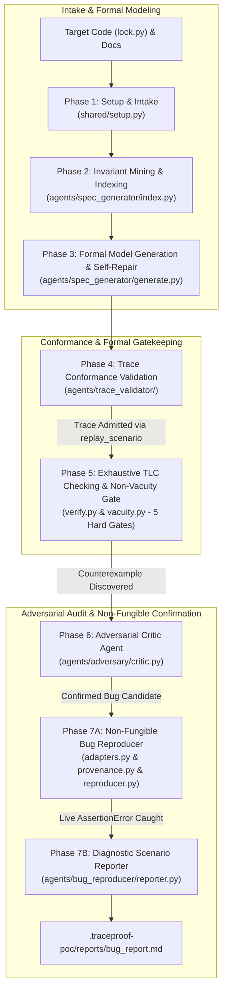
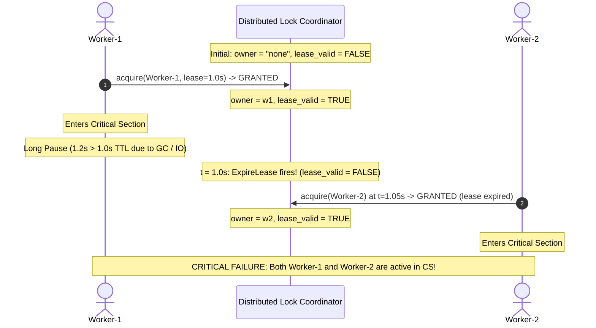

# TraceProof: Autonomous Formal Verification & Deterministic Bug Reproduction Pipeline

[](https://lamport.azurewebsites.net/tla/tla.html)
[](https://github.com/microsoft/tla)
[](tests/)
[](LICENSE)
[](https://www.python.org/)

TraceProof is an autonomous formal verification and deterministic bug reproduction pipeline for concurrent and distributed systems. Inspired by modern formal methods research (including the **Specula** framework), TraceProof extracts formal TLA+ specifications directly from real code, mathematically verifies model-code conformance via runtime trace replay, exhaustively checks state spaces using the TLC engine, guards against trivial specifications with a **5-Gate Non-Vacuity Gatekeeper**, audits counterexamples with an **Adversarial Critic Agent**, and deterministically reproduces concurrency bugs on live runtime threads via a **Non-Fungible, Transition-Derived Reproducer**.

---

## Table of Contents
1. [High-Level Architecture](#1-high-level-architecture)
2. [The 7 Pipeline Stages](#2-the-7-pipeline-stages)
   - [Phase 1: Run Intake & Configuration](#phase-1-run-intake--configuration-sharedsetuppy)
   - [Phase 2: Invariant Mining & Code Indexing](#phase-2-invariant-mining--code-indexing-agentsspec_generatorindexpy)
   - [Phase 3: Model Generation & Syntax Self-Repair](#phase-3-model-generation--syntax-self-repair-agentsspec_generatorgeneratepy)
   - [Phase 4: Trace Validation & Conformance](#phase-4-trace-validation--model-code-conformance-agentstrace_validator)
   - [Phase 5: TLC Checking & 5-Gate Non-Vacuity Gatekeeper](#phase-5-exhaustive-model-checking--5-gate-non-vacuity-gatekeeper-agentsspec_generatorverifyy-agentsspec_generatorvacuitypy)
   - [Phase 6: Adversarial Critic Agent](#phase-6-adversarial-critic-agent-agentsadversarycriticpy)
   - [Phase 7: Non-Fungible Bug Confirmation & Telemetry](#phase-7-non-fungible-bug-confirmation--diagnostic-reporting-agentsbug_reproducer)
3. [The Target Problem: Distributed Leased Lock Anomaly](#3-the-target-problem-distributed-leased-lock-anomaly)
4. [Project Directory Layout](#4-project-directory-layout)
5. [Prerequisites & Environment Setup](#5-prerequisites--environment-setup)
6. [Quickstart Guide](#6-quickstart-guide)
7. [Automated Test Suite & Continuous Integration](#7-automated-test-suite--continuous-integration)
8. [CLI Reference](#8-cli-reference)
9. [Artifacts & Verification Provenance](#9-artifacts--verification-provenance)
10. [Design Philosophy & Scope Boundary](#10-design-philosophy--scope-boundary)

---

## 1. High-Level Architecture



---

## 2. The 7 Pipeline Stages

### Phase 1: Run Intake & Configuration (`shared/setup.py`)
- Ingests source files, documentation, and execution flags (`--source`, `--docs`, `--provider`, `--self-repair-cap`).
- Validates LLM provider connectivity (`gemini-3.7-flash` / `gemini-3.6-flash`, Anthropic, OpenAI, or local backends).
- Enforces global self-repair loop attempt caps to **5 attempts**.
- Initializes workspace state and writes `.traceproof-poc/run-config.md`.

### Phase 2: Invariant Mining & Code Indexing (`agents/spec_generator/index.py`)
- Analyzes target source code using AST parsing and static analysis.
- Extracts mutable shared state variables (`current_owner`, `lease_expiry`, `active_workers`, `storage`).
- Extracts functional entry points (`acquire`, `release`, `do_work`).
- Mines candidate safety properties (e.g. `MutualExclusion == Cardinality(active_workers) <= 1`).
- Writes structured knowledge cache to `.traceproof-poc/knowledge/`.

### Phase 3: Model Generation & Syntax Self-Repair (`agents/spec_generator/generate.py`)
- Synthesizes pure mathematical TLA+ specifications (`base.tla`) and configurations (`base.cfg`).
- Sanitizes LLM outputs by stripping markdown backtick fences and PlusCal artifacts.
- **Autonomous Self-Repair Loop (5 attempts)**: Connects to `tla-mcp` via JSON-RPC 2.0 to run `validate_spec`. If syntax errors occur, the LLM repairs the spec. Includes a deterministic pure TLA+ fallback for resilience.

### Phase 4: Trace Validation / Model-Code Conformance (`agents/trace_validator/`)
- **Crucial Conformance Gate**: Guarantees that the formal model reflects physical reality before exploring states (preventing hallucinated models).
- Dynamically instruments the target code (`tracer.py`) to harvest physical execution events (`Acquire`, `ExitCS`) from live Python threads.
- Synthesizes a TLA+ `replay_scenario` and replays it through `tla-mcp`.
- Runs an autonomous 5-attempt repair loop if conformance gaps appear.
- Writes proof certificate to `.traceproof-poc/validation/trace-validation.md`.

### Phase 5: Exhaustive Model Checking & 5-Gate Non-Vacuity Gatekeeper (`agents/spec_generator/verify.py` & `agents/spec_generator/vacuity.py`)
- Drives `/usr/local/bin/tla-mcp` using Model Context Protocol (JSON-RPC 2.0 stdio).
- Runs `check_spec` (TLC model checker) over the complete state space.
- **The 5 Deterministic Non-Vacuity & Correspondence Gates**:
  1. **Gate 1: AST Tautology & Invariant Analysis**: Parses AST to strictly reject trivial invariants (`TRUE`, `1=1`, `x=x`, or variable-free invariants) across **all** declared invariants in `.cfg`.
  2. **Gate 2: Configuration Completeness**: Enforces that every `.cfg` declares an `INVARIANT` bound to a valid operator in `.tla`.
  3. **Gate 3: Structural Implementation Correspondence**: Fails closed (`ImplementationCorrespondenceError`) if in-scope Python state variables are omitted from TLA+ `VARIABLES`, unless explicitly excluded via `\* @exclude_vars` or CLI. Enforces exact normalized identifier matching (no loose single-token overlap). Supports directory trees and multi-source paths.
  4. **Gate 4: State Exploration & Tiered Action Coverage**: Rejects models where `distinct_states <= 1` or `transitions == 0`. Inspects structured TLC action logs to prove all core actions executed.
  5. **Gate 5: Dual Mutation Verification**:
     - *Invariant Negation Mutation*: Weakens spec to `Init \/ ~(Inv)` and strictly requires transition depth $\ge 1$, rejecting violations at the initial state.
     - *Guard Mutation Sweep*: Weakens action guards to `TRUE` and requires a **100% kill rate** (`survivors == 0`). Forwards TLC limits and marks resource timeouts as `InconclusiveMutationError`.
- Extracts the minimal 4-step counterexample trace into `.traceproof-poc/export/manifest.md`.

### Phase 6: Adversarial Critic Agent (`agents/adversary/critic.py`)
- An independent LLM agent acts as a skeptical red-teamer to audit the counterexample:
  1. **Invariant Soundness**: Is `MutualExclusion` a true invariant requirement of the system?
  2. **Model Fidelity**: Does the TLA+ spec accurately represent the code, or did it omit real-world synchronization primitives or fencing tokens?
  3. **Concurrency Feasibility**: Can this thread schedule physically occur under normal OS preemption and latency?
- Emits a verdict (`CONFIRMED_BUG_CANDIDATE`, confidence 0.98) and reproduction guidance to `.traceproof-poc/adversary/adversary-report.md`.

### Phase 7: Non-Fungible Bug Confirmation & Diagnostic Reporting (`agents/bug_reproducer/`)
- **Non-Fungible Provenance Binding (`provenance.py`)**:
  - Computes cryptographic SHA-256 fingerprints across: target source file (`target_source_hash`), formal model `base.tla` (`spec_hash`), configuration `base.cfg` (`cfg_hash`), and TLC counterexample trace (`counterexample_hash`).
  - Embeds runtime integrity checks in `test_reproduce_bug.py`: halts execution with `RuntimeError: Cryptographic Provenance Mismatch!` if the target source is modified after verification.
- **Dynamic Target-Adapter Interface (`adapters.py`)**:
  - `TargetAdapter` base class with concrete `DistLockAdapter` and `GenericFunctionAdapter`.
  - Dynamically imports the target module via `importlib.util` (removing hardcoded module names).
  - **Fail-Closed Policy**: Rejects unmapped actions immediately with `UnmappedActionError`.
- **1-to-1 Transition-by-Transition Derivation (`templates.py` & `reproducer.py`)**:
  - Translates each counterexample transition $(S_{k-1} \xrightarrow{\text{Action}} S_k)$ into an explicit Python scheduler step citing the TLC transition.
  - Catches live `AssertionError: Mutual exclusion broken! Total violations detected: 1`.
  - Rejects missing or malformed counterexamples with `MissingCounterexampleError` / `MalformedCounterexampleError`.
- **Diagnostic Scenario Report (`reporter.py`)**:
  - Compiles all pipeline evidence into an executive-ready Markdown report at `.traceproof-poc/reports/bug_report.md` formatted in Egypt Time (`UTC+3`).
  - Contains full Cryptographic Provenance tables, Transition-by-Transition Derivation tables, and Adversarial Critic findings.

---

## 3. The Target Problem: Distributed Leased Lock Anomaly

The pipeline targets a classic, high-impact distributed systems failure mode: **The Leased Lock / Redlock Anomaly (Martin Kleppmann vs. Salvatore Sanfilippo)**.

### The Problem in Code ([`examples/dist_lock/lock.py`](examples/dist_lock/lock.py)):
```python
def acquire(worker_id: str, lease_duration: float = 1.0) -> bool:
    global current_owner, lease_expiry
    now = time.time()
    # Flaw: Lease expiration permits acquisition while previous worker is still executing!
    if current_owner is None or now >= lease_expiry:
        current_owner = worker_id
        lease_expiry = now + lease_duration
        return True
    return False
```

### The TLC Counterexample Schedule:


---

## 4. Project Directory Layout

```text
PoC/
├── run.sh                          # Master automated execution script
├── cli.py                          # Unified CLI entry point
├── Walkthrough.md                  # Comprehensive deep-dive walkthrough with code snippets
├── LICENSE                         # MIT License
├── .github/
│   └── workflows/
│       └── ci.yml                  # GitHub Actions CI workflow (builds tla-mcp & runs tests)
├── shared/                         # Core setup, configuration & LLM interfaces
│   ├── client.py                   # Provider-agnostic LLM interface
│   ├── schemas.py                  # Pydantic models for run configs
│   └── setup.py                    # Phase 1 intake & runner
├── agents/
│   ├── spec_generator/             # Phases 2, 3, & 5
│   │   ├── index.py                # Invariant mining & AST indexing
│   │   ├── generate.py             # TLA+ model generation & repair loop
│   │   ├── prompts.py              # Spec generation prompts
│   │   ├── verify.py               # MCP JSON-RPC client for tla-mcp (TLC)
│   │   └── vacuity.py              # 5-Gate Non-Vacuity & Correspondence Gatekeeper
│   ├── trace_validator/            # Phase 4
│   │   ├── tracer.py               # Runtime event trace harvester
│   │   ├── validator.py            # replay_scenario conformance validator
│   │   └── prompts.py              # Trace mapping & model repair prompts
│   ├── adversary/                  # Phase 6
│   │   ├── critic.py               # Adversarial Refinement Critic Agent
│   │   └── prompts.py              # Adversarial critique prompts & fallbacks
│   └── bug_reproducer/             # Phase 7
│       ├── adapters.py             # Target-Adapter interface (DistLock, GenericFunction)
│       ├── provenance.py           # Cryptographic SHA-256 provenance receipts & tamper checks
│       ├── reproducer.py           # Deterministic live replay test generator
│       ├── reporter.py             # Diagnostic report generator
│       └── templates.py            # Transition-derived test harness & report templates
├── examples/
│   └── dist_lock/                  # Target distributed system
│       ├── lock.py                 # Distributed lock with lease expiration
│       └── README.md
├── tests/                          # Automated test suite (40 tests)
│   ├── test_e2e_verify.py          # Live end-to-end integration tests against tla-mcp
│   ├── test_vacuity.py             # 26 unit tests for all 5 vacuity gates & correspondence
│   └── test_reproducer.py          # 10 unit & integration tests for provenance & reproducer
└── .traceproof-poc/                # Pipeline run artifacts (auto-generated)
    ├── run-config.md               # Run metadata & settings
    ├── knowledge/                  # Mined AST symbols & invariants
    ├── model/                      # Generated TLA+ specs (base.tla, base.cfg)
    ├── validation/                 # Trace validation conformance reports
    ├── export/                     # TLC counterexample manifest (manifest.md)
    ├── adversary/                  # Adversary critique & confidence assessment
    ├── reproduction/               # Generated test harness & execution telemetry
    └── reports/                    # Final executive diagnostic report (bug_report.md)
```

---

## 5. Prerequisites & Environment Setup

### 1. Python Environment
```bash
python3 -m venv .venv
source .venv/bin/activate
pip install -r requirements.txt
```

### 2. TLA-RS Model Context Protocol Binary (`tla-mcp`)
TraceProof interfaces with TLA+ via `tla-mcp` (built from the [tla-rs](https://github.com/fabracht/tla-rs) repository):
```bash
# Verify installation
which tla-mcp
# Expected: /usr/local/bin/tla-mcp or ~/.cargo/bin/tla-mcp
```
To install from source via Cargo:
```bash
cargo install --git https://github.com/fabracht/tla-rs --bin tla-mcp
```

### 3. LLM API Key (for Phases 2, 3, 4, 6)
```bash
export TRACEPROOF_API_KEY="your-api-key-here"
```

---

## 6. Quickstart Guide

To execute the entire 7-stage pipeline autonomously:

```bash
./run.sh
```

---

## 7. Automated Test Suite & Continuous Integration

TraceProof includes a comprehensive 40-test automated verification suite:

```bash
# Run all 40 unit and live integration tests
TRACEPROOF_REQUIRE_LIVE_CHECKER=1 python3 -m unittest discover tests -v
```

### Test Suite Breakdown:
1. **Reproducer Suite (`tests/test_reproducer.py` — 10 tests)**:
   - Valid leased-lock counterexample reproduction with step citations and SHA-256 hashes.
   - Second, structurally different concurrency target (`bounded_queue.py` test fixture) proving zero hardcoded target names.
   - Unknown-action rejection (`UnmappedActionError`).
   - Incomplete transition mapping rejection.
   - Inconsistent target/trace pair rejection.
   - Missing or malformed counterexample rejection and runtime tamper detection on altered sources.
2. **Non-Vacuity & Correspondence Suite (`tests/test_vacuity.py` — 26 tests)**:
   - Covers Gate 1 (AST tautologies, variable-free invariants, multi-invariant configs).
   - Covers Gate 2 (missing config, unbound invariant).
   - Covers Gate 3 (missing state variables, variable exclusion, directory & multi-source resolution, exact identifier matching).
   - Covers Gate 4 (dead action detection, aggregate Next reporting).
   - Covers Gate 5 (100% kill rate enforcement, partial survivor rejection, transition depth $\ge 1$, TLC limit handling).
3. **Live End-to-End Suite (`tests/test_e2e_verify.py` — 4 tests)**:
   - Real subprocess execution against `/usr/local/bin/tla-mcp`.

---

## 8. CLI Reference

Individual phases can be run independently via `cli.py`:

| Subcommand | Description | Example Command |
|---|---|---|
| `run` | Phase 1: Initialize run & write configuration | `python3 cli.py run --source examples/dist_lock --provider gemini` |
| `index` | Phase 2: Mine invariants & AST knowledge | `python3 cli.py index --out .traceproof-poc` |
| `generate` | Phase 3: Synthesize & repair TLA+ model | `python3 cli.py generate --out .traceproof-poc` |
| `trace-validate` | Phase 4: Validate model-code conformance | `python3 cli.py trace-validate --source examples/dist_lock` |
| `verify` | Phase 5: Run TLC & 5-gate non-vacuity gatekeeper | `python3 cli.py verify --out .traceproof-poc` |
| `adversary` | Phase 6: Run Adversarial Critic Agent | `python3 cli.py adversary --source examples/dist_lock` |
| `reproduce` | Phase 7: Non-fungible replay & diagnostic report | `python3 cli.py reproduce --source examples/dist_lock` |

---

## 9. Artifacts & Verification Provenance

| Artifact | Path | Description |
|---|---|---|
| **Run Config** | `.traceproof-poc/run-config.md` | Snapshot of run parameters, provider, and source paths |
| **Knowledge Index** | `.traceproof-poc/knowledge/_index.md` | Extracted AST symbols, functions, and mined invariants |
| **Formal Spec** | `.traceproof-poc/model/base.tla` | Pure TLA+ specification modeling the code |
| **Trace Conformance** | `.traceproof-poc/validation/trace-validation.md` | `replay_scenario` proof that model admits real code traces |
| **Counterexample** | `.traceproof-poc/export/manifest.md` | State-by-state trace from TLC proving invariant violation |
| **Adversary Critique** | `.traceproof-poc/adversary/adversary-report.md` | LLM critic review of invariant soundness & preemption feasibility |
| **Replay Script** | `.traceproof-poc/reproduction/test_reproduce_bug.py` | Auto-generated deterministic reproduction script with provenance check |
| **Replay Result** | `.traceproof-poc/reproduction/reproduction_result.json` | Execution telemetry, transition mapping table, and SHA-256 hashes |
| **Diagnostic Report** | `.traceproof-poc/reports/bug_report.md` | Complete executive diagnostic report in Egypt Time (`UTC+3`) |

---

## 10. Design Philosophy & Scope Boundary

1. **Detection & Scenario Delivery, Not Auto-Patching**:  
   TraceProof detects deep concurrency flaws and delivers the exact physical execution schedule to trigger them. Remediation remains with human engineers.
2. **Deterministic Empirical Grounding**:  
   A formal counterexample is only considered a confirmed bug once it has been deterministically reproduced on the real runtime with an `AssertionError`.
3. **Non-Invasive Verification**:  
   TraceProof never modifies the target source code. All trace harvesting and test harnesses are external and non-invasive.
4. **Non-Fungible Traceability**:  
   Every generated test harness is cryptographically bound to the exact source and formal verification artifacts that produced it.
