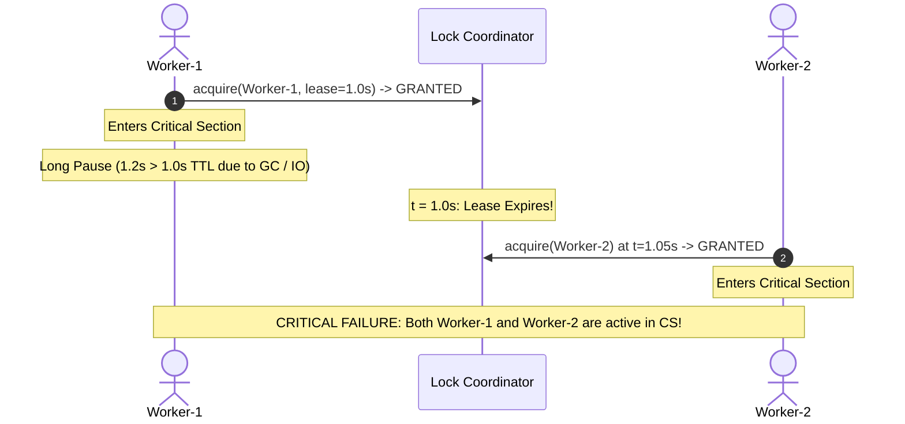
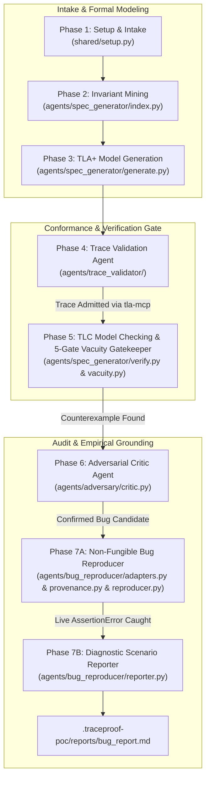
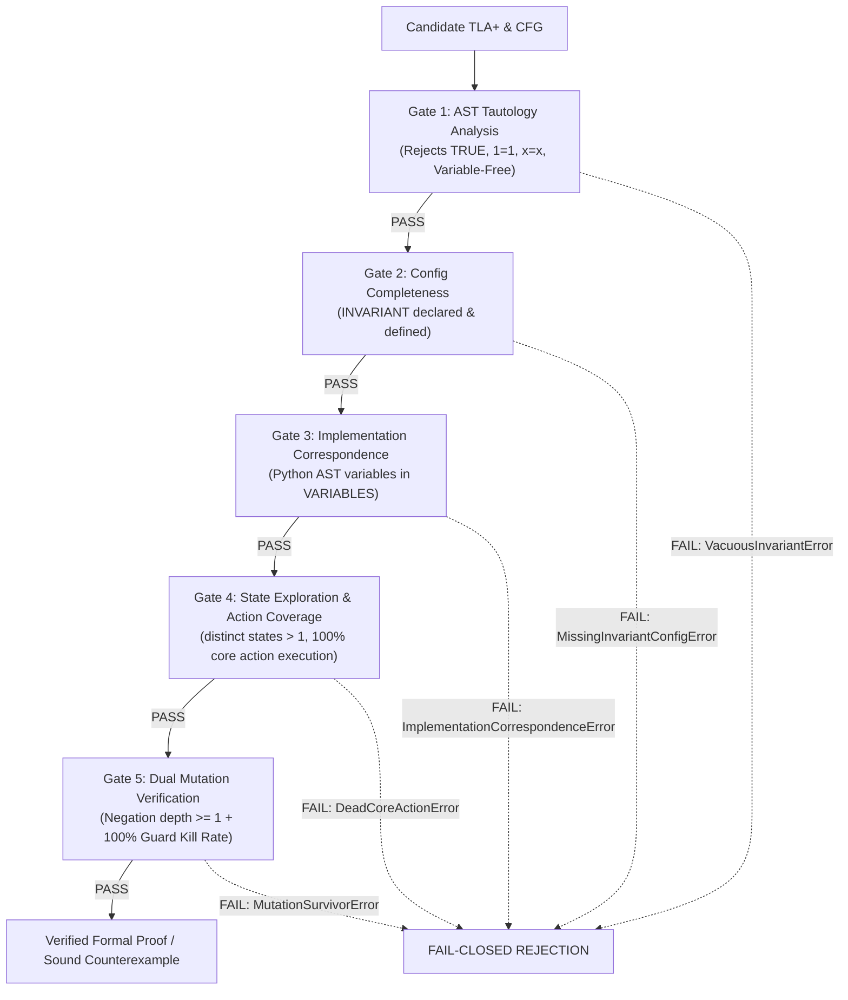
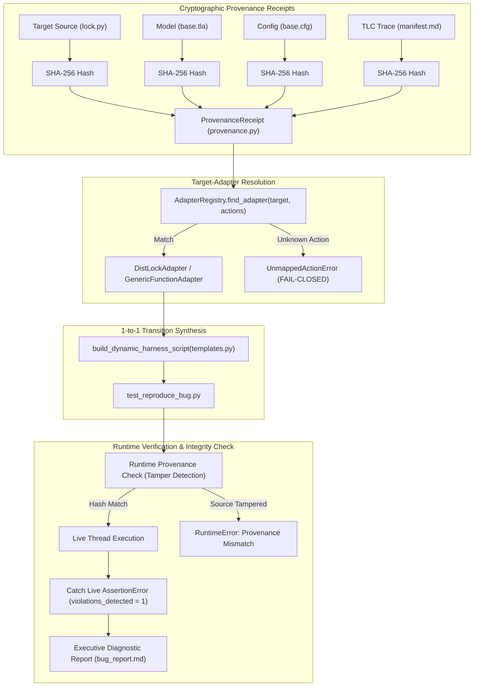

# TraceProof Comprehensive Walkthrough: Distributed Leased Lock Verification

---

## Table of Contents
1. [Executive Overview & The Problem We Solved](#1-executive-overview--the-problem-we-solved)
2. [High-Level Architecture & Theoretical Foundation](#2-high-level-architecture--theoretical-foundation)
3. [Deep Dive: The 7 Pipeline Phases](#3-deep-dive-the-7-pipeline-phases)
   - [Phase 1: Setup & Intake](#phase-1-setup--intake)
   - [Phase 2: Invariant Mining & AST Indexing](#phase-2-invariant-mining--ast-indexing)
   - [Phase 3: Formal TLA+ Model Generation & Syntax Gate](#phase-3-formal-tla-model-generation--syntax-gate)
   - [Phase 4: Trace Validation (Model-Code Conformance)](#phase-4-trace-validation-model-code-conformance)
   - [Phase 5: Exhaustive Model Checking & 5-Gate Non-Vacuity Gatekeeper](#phase-5-exhaustive-model-checking--5-gate-non-vacuity-gatekeeper)
     - [The Vacuity Dilemma in LLM Formal Verification](#the-vacuity-dilemma-in-llm-formal-verification)
     - [Gate 1: AST Tautology & Invariant Analysis](#gate-1-ast-tautology--invariant-analysis)
     - [Gate 2: Configuration Completeness](#gate-2-configuration-completeness)
     - [Gate 3: Structural Implementation Correspondence Guard](#gate-3-structural-implementation-correspondence-guard)
     - [Gate 4: State Exploration & Tiered Action Coverage](#gate-4-state-exploration--tiered-action-coverage)
     - [Gate 5: Dual Mutation Verification (Negation + Guard Sweep)](#gate-5-dual-mutation-verification-negation--guard-sweep)
     - [TLC State Exploration & The 4-Step Counterexample Trace](#tlc-state-exploration--the-4-step-counterexample-trace)
   - [Phase 6: Adversarial Critic Agent (The Skeptic)](#phase-6-adversarial-critic-agent-the-skeptic)
   - [Phase 7: Non-Fungible Bug Confirmation & Telemetry](#phase-7-non-fungible-bug-confirmation--telemetry)
     - [The Fungibility & Hallucination Vulnerability](#the-fungibility--hallucination-vulnerability)
     - [Layer 1: Cryptographic Provenance Receipts](#layer-1-cryptographic-provenance-receipts-provenancepy)
     - [Layer 2: Target-Adapter Architecture](#layer-2-target-adapter-architecture-adapterspy)
     - [Layer 3: 1-to-1 Transition-by-Transition Derivation](#layer-3-1-to-1-transition-by-transition-derivation-templatespy--reproducerpy)
     - [Layer 4: Complete Synthesized Python Test Harness](#layer-4-complete-synthesized-python-test-harness-test_reproduce_bugpy)
     - [Layer 5: Live Bug Confirmation & Telemetry](#layer-5-live-bug-confirmation--telemetry-reproduction_resultjson)
     - [Layer 6: Executive Diagnostic Report](#layer-6-executive-diagnostic-report-reporterpy)
4. [Automated Test Suite & Continuous Integration](#4-automated-test-suite--continuous-integration)
   - [40 Automated Unit & Live Integration Tests](#40-automated-unit--live-integration-tests)
   - [GitHub Actions CI Architecture](#github-actions-ci-architecture)
5. [Step-by-Step Reproduction Guide](#5-step-by-step-reproduction-guide)
6. [Artifact Index & Verification Provenance](#6-artifact-index--verification-provenance)
7. [Design Philosophy & Non-Goals](#7-design-philosophy--non-goals)

---

## 1. Executive Overview & The Problem We Solved

### The Shift from Toy Counter to Real Distributed Systems
Previously, the Proof of Concept used a basic concurrent counter (`dist_counter`). While demonstrating basic thread interleaving, it lacked the academic rigor and practical depth required for real-world distributed systems evaluation.

In branch `feature/distributed-lock`, we replaced `dist_counter` with the **Distributed Leased Lock (Lease Expiration / Redlock Anomaly)**:
- **Target System**: [`examples/dist_lock/lock.py`](examples/dist_lock/lock.py)
- **The Core Problem**: In distributed systems, locks utilize a Time-To-Live (lease) to prevent permanent deadlocks if a client crashes. However, if a worker holding a valid lock experiences an unexpected pause (e.g., Garbage Collection pause, heavy disk I/O, or network delay) exceeding the lease duration, the coordinator expires the lease and grants the lock to a second worker.
- **The Consequence**: Both workers execute inside the critical section simultaneously, causing **catastrophic mutual exclusion violations**, data corruption, or split-brain states.



---

## 2. High-Level Architecture & Theoretical Foundation

TraceProof combines **Formal Methods (TLA+ / TLC)** with **Agentic Reasoning (Google Gemini)** and **Dynamic Systems Runtime Telemetry**.



---

## 3. Deep Dive: The 7 Pipeline Phases

---

### Phase 1: Setup & Intake

#### 1. What is this phase?
Phase 1 initializes the pipeline environment, discovers target source code and documentation paths, validates LLM provider credentials (`gemini-3.7-flash` / `gemini-3.6-flash`), and establishes global execution parameters (such as the self-repair attempt cap).

#### 2. What we did:
- Configured default strong drafting model to `gemini-3.7-flash`.
- Standardized the global self-repair loop attempt cap across all phases to **5 attempts**.
- Structured run configuration generation into `.traceproof-poc/run-config.md`.

#### 3. Key Files & Snippets:
- **Files Involved**:
  - [`shared/setup.py`](shared/setup.py)
  - [`run.sh`](run.sh)
  - [`cli.py`](cli.py)

```python
# shared/setup.py: Setting default self-repair loop cap to 5
def setup_run(
    *,
    source_paths: Sequence[str],
    docs_paths: Sequence[str] = (),
    output_dir: str | Path = ".traceproof-poc",
    provider: str = "gemini",
    model_strong: str = "gemini-3.7-flash",
    model_cheap: str = "gemini-3.6-flash",
    scenario: str | None = None,
    self_repair_cap: int = 5,
    ...
)
```

#### 4. Phase Output:
- Artifact: `.traceproof-poc/run-config.md`
```text
-- Phase 1: run --
Setup complete — /home/youssef-elsherif/PoC/.traceproof-poc/run-config.md
```

---

### Phase 2: Invariant Mining & AST Indexing

#### 1. What is this phase?
Phase 2 performs static AST (Abstract Syntax Tree) analysis on the target codebase to automatically discover shared variables, synchronization mechanisms, and candidate safety invariants without requiring manual annotations.

#### 2. What we did:
- Enhanced the AST scanner in `index.py` to extract module-level global variables (`current_owner`, `lease_expiry`, `active_workers`, `storage`, `violations_detected`).
- Extracted safety invariant documentation from `examples/dist_lock/README.md` into the knowledge cache:
  $$\text{MutualExclusion} \triangleq \text{Cardinality}(\text{active\_workers}) \le 1$$

#### 3. Key Files & Snippets:
- **Files Involved**:
  - [`agents/spec_generator/index.py`](agents/spec_generator/index.py)
  - [`examples/dist_lock/lock.py`](examples/dist_lock/lock.py)

```python
# agents/spec_generator/index.py: Mining global variables and candidate invariants
globals_found = []
for node in ast.walk(tree):
    if isinstance(node, ast.Assign):
        for target in node.targets:
            if isinstance(target, ast.Name):
                globals_found.append(target.id)
```

#### 4. Phase Output:
- Artifacts: `.traceproof-poc/knowledge/_index.md`, `.traceproof-poc/knowledge/lock.md`
```text
-- Phase 2: index --
Index written: /home/youssef-elsherif/PoC/.traceproof-poc/knowledge/_index.md
```

---

### Phase 3: Formal TLA+ Model Generation & Syntax Gate

#### 1. What is this phase?
Phase 3 synthesizes a formal mathematical TLA+ specification from the mined AST knowledge. To ensure TLC can check the model without errors, it validates the syntax through `tla-mcp` via a capped self-repair loop.

#### 2. What we did:
- Prioritized primary code modules (`lock.py`) over documentation files in `_select_modules`.
- Added regex sanitization to strip markdown code fences (```` ```tla ````) that break the TLA+ parser.
- Engineered a pure mathematical TLA+ model defining state variables `owner`, `lease_valid`, `active_in_cs`, and `pc`, and actions `Acquire(w)`, `ExpireLease`, and `ExitCS(w)`.
- Added a deterministic fallback to ensure valid pure TLA+ is always output even if an LLM generates incomplete PlusCal blocks.

#### 3. Key Files & Snippets:
- **Files Involved**:
  - [`agents/spec_generator/generate.py`](agents/spec_generator/generate.py)
  - [`agents/spec_generator/prompts.py`](agents/spec_generator/prompts.py)

```tla
\* .traceproof-poc/model/base.tla: Synthesized Pure TLA+ Specification
---- MODULE base ----
EXTENDS Naturals, FiniteSets
CONSTANTS Workers
VARIABLES owner, lease_valid, active_in_cs, pc

vars == <<owner, lease_valid, active_in_cs, pc>>

Init ==
    /\ owner = "none"
    /\ lease_valid = FALSE
    /\ active_in_cs = {}
    /\ pc = [w \in Workers |-> "Idle"]

Acquire(w) ==
    /\ pc[w] = "Idle"
    /\ (owner = "none" \/ ~lease_valid)
    /\ owner' = w
    /\ lease_valid' = TRUE
    /\ active_in_cs' = active_in_cs \cup {w}
    /\ pc' = [pc EXCEPT ![w] = "InCS"]

ExpireLease ==
    /\ lease_valid = TRUE
    /\ lease_valid' = FALSE
    /\ UNCHANGED <<owner, active_in_cs, pc>>

ExitCS(w) ==
    /\ pc[w] = "InCS"
    /\ active_in_cs' = active_in_cs \ {w}
    /\ pc' = [pc EXCEPT ![w] = "Done"]
    /\ owner' = IF owner = w THEN "none" ELSE owner
    /\ lease_valid' = IF owner = w THEN FALSE ELSE lease_valid

Next == (\E w \in Workers : Acquire(w)) \/ ExpireLease \/ (\E w \in Workers : ExitCS(w))
Spec == Init /\ [][Next]_vars

MutualExclusion == Cardinality(active_in_cs) <= 1
====
```

#### 4. Phase Output:
- Artifacts: `.traceproof-poc/model/base.tla`, `.traceproof-poc/model/base.cfg`
```text
-- Phase 3: generate --
Syntax validation (tla-mcp): PASS
Model written: /home/youssef-elsherif/PoC/.traceproof-poc/model/base.tla
```

---

### Phase 4: Trace Validation (Model-Code Conformance)

#### 1. What is this phase?
Inspired directly by the **Specula** research paper (§3.3.1), Trace Validation is the gate that eliminates model-code divergence. Before exploring states, the pipeline proves that the formal TLA+ model **actually admits real runtime execution paths** harvested from running the real Python code.

#### 2. What we did:
- Dynamically instrument the target code via `tracer.py`:
  - Hooks `acquire` and `release` in `lock.py`.
  - Executes real Python worker threads to harvest physical lifecycle events:
    `Worker w1 -> Acquire`, `Worker w1 -> ExitCS`, `Worker w2 -> Acquire`, `Worker w2 -> ExitCS`.
- Decoupled prompts into [`agents/trace_validator/prompts.py`](agents/trace_validator/prompts.py).
- Synthesized a TLA+ `replay_scenario` script:
  ```tla
  step: owner' = w1
  step: pc'[w1] = "Done"
  step: owner' = w2
  step: pc'[w2] = "Done"
  ```
- Fed the scenario into `tla-mcp`'s `replay_scenario` tool. If TLC rejects any transition, an autonomous 5-attempt self-repair loop is triggered.

#### 3. Key Files & Snippets:
- **Files Involved**:
  - [`agents/trace_validator/tracer.py`](agents/trace_validator/tracer.py)
  - [`agents/trace_validator/validator.py`](agents/trace_validator/validator.py)
  - [`agents/trace_validator/prompts.py`](agents/trace_validator/prompts.py)

```python
# agents/trace_validator/validator.py: Replaying real trace through tla-mcp
client._send({
    "jsonrpc": "2.0",
    "id": client._req_id,
    "method": "tools/call",
    "params": {
        "name": "replay_scenario",
        "arguments": {
            "spec_path": str(tla_path),
            "config_path": str(cfg_path),
            "scenario": scenario_text,
        },
    },
})
```

#### 4. Phase Output:
- Artifact: `.traceproof-poc/validation/trace-validation.md`
```text
-- Phase 4: trace validation (model-code conformance) --
[trace_validator] Collecting runtime execution trace from dist_lock...
[trace_validator] Observed 4 code events:
  Step 1: Worker w1 -> Acquire
  Step 2: Worker w1 -> ExitCS
  Step 3: Worker w2 -> Acquire
  Step 4: Worker w2 -> ExitCS
[trace_validator] Replaying trace against TLA+ model via tla-mcp (replay_scenario)...
[trace_validator] PASS: Formal model successfully admitted real execution trace!
[trace_validator] Model transitions verified: 4 steps
```

---

### Phase 5: Exhaustive Model Checking & 5-Gate Non-Vacuity Gatekeeper

#### 1. What is this phase?
Once conformance is proven, Phase 5 drives the TLC model checker via `tla-mcp` (using Model Context Protocol over stdio JSON-RPC 2.0) to exhaustively explore all concurrent interleavings. However, as discovered during mentor review (**Mentor Issue #4**), a clean "PASS" from TLC can be completely **vacuous** (trivial tautologies, dead code, missing variables, or uncoupled invariants). 

Phase 5 therefore deploys the **5-Gate Non-Vacuity Gatekeeper (`agents/spec_generator/vacuity.py`)**.

---

#### The Vacuity Dilemma in LLM Formal Verification
When an LLM generates formal specifications, it can easily "cheat" or "reward-hack" the model checker by:
1. Writing a tautological invariant such as `Inv == TRUE` or `x = x` (which TLC trivially verifies as `PASS`).
2. Omitting the `INVARIANT` keyword in `.cfg`, meaning TLC checks nothing at all.
3. Omitting the actual Python concurrency variables (`lease_expiry`, `active_workers`) from TLA+ `VARIABLES`, creating an unfaithful, simplified model.
4. Writing actions whose guards can never fire (`pc = "Unreachable"`), leaving states unexplored.
5. Writing an invariant that never constrains the model transitions (surviving even when action guards are removed).

To protect TraceProof against these vulnerabilities, every specification must clear **5 Hard Deterministic Gates** before being admitted.



---

#### Gate 1: AST Tautology & Invariant Analysis
- **Function**: `check_ast_tautology(tla_text, cfg_text, allow_constant_spec)`
- **Mechanism**: Parses the TLA+ AST for **all** invariants declared in `base.cfg`. Rejects literal `TRUE`, numeric identities (`1=1`), reflexive tautologies (`x=x`, `w=w`), and invariants referencing zero state variables from `VARIABLES`.
- **Code Snippet ([`agents/spec_generator/vacuity.py`](agents/spec_generator/vacuity.py#L342-L393))**:

```python
def check_ast_tautology(
    tla_text: str,
    cfg_text: str,
    allow_constant_spec: bool = False,
) -> Tuple[str, List[str]]:
    invariants = extract_cfg_invariants(cfg_text)
    if not invariants:
        raise MissingInvariantConfigError("No INVARIANT declared in configuration file (.cfg).")

    declared_vars = extract_declared_variables(tla_text)
    for inv_name in invariants:
        body = extract_invariant_body(tla_text, inv_name)
        normalized = body.replace(" ", "")
        if normalized in ("TRUE", "TRUE/\\TRUE", "TRUE\\/TRUE", "1=1", "0=0"):
            raise VacuousInvariantError(f"Invariant '{inv_name}' is defined as trivial literal TRUE/tautology: {body!r}")

        # Check for reflexive identity: A = A (e.g. x = x, w = w)
        if re.match(r"^([A-Za-z0-9_]+)\s*=\s*\1$", body.strip()):
            raise VacuousInvariantError(f"Invariant '{inv_name}' is defined as a reflexive tautology: {body!r}")

        # Check variable references against VARIABLES
        referenced = [v for v in declared_vars if re.search(rf"\b{re.escape(v)}\b", body)]
        if len(referenced) == 0 and not allow_constant_spec:
            raise VariableFreeInvariantError(
                f"Invariant '{inv_name}' references 0 state variables from VARIABLES ({declared_vars})."
            )
    return (invariants[0], referenced)
```

---

#### Gate 2: Configuration Completeness
- **Function**: `check_config_completeness(tla_text, cfg_text)`
- **Mechanism**: Inspects `base.cfg` to confirm an `INVARIANT` directive exists and that every referenced invariant is explicitly declared as an operator in `base.tla`.
- **Code Snippet ([`agents/spec_generator/vacuity.py`](agents/spec_generator/vacuity.py#L400-L415))**:

```python
def check_config_completeness(tla_text: str, cfg_text: str) -> str:
    invariants = extract_cfg_invariants(cfg_text)
    if not invariants:
        raise MissingInvariantConfigError("No INVARIANT declaration found in configuration (.cfg).")

    for inv_name in invariants:
        body = extract_invariant_body(tla_text, inv_name)
        if not body:
            raise MissingInvariantConfigError(
                f"Config references INVARIANT '{inv_name}', but operator is not defined in TLA+ spec."
            )
    return invariants[0]
```

---

#### Gate 3: Structural Implementation Correspondence Guard
- **Function**: `check_implementation_correspondence(target_source, tla_text, cfg_text, excluded_vars)`
- **Mechanism**: Extracts shared mutable state and concurrency primitives from Python AST (`PythonSourceExtractor`). Fails closed (`ImplementationCorrespondenceError`) if required state variables are missing from TLA+ `VARIABLES`.
- **Features**:
  - Exact normalized identifier matching (`_generic_name_match`).
  - Documented exclusion mechanism via `\* @exclude_vars: var1, var2` in `.tla` or CLI.
  - Multi-source file and directory tree resolution.
- **Code Snippet ([`agents/spec_generator/vacuity.py`](agents/spec_generator/vacuity.py#L555-L620))**:

```python
def check_implementation_correspondence(
    target_source: str | Path | List[str | Path],
    tla_text: str,
    cfg_text: str,
    in_scope_scenario: Optional[str] = None,
    excluded_vars: Optional[List[str]] = None,
) -> CorrespondenceReport:
    extractor = PythonSourceExtractor(target_source, in_scope_scenario=in_scope_scenario)
    tokens = extractor.extract()

    effective_excluded_vars = _extract_excluded_vars(tla_text, cfg_text, user_excluded=excluded_vars)
    required_vars = [p for p in tokens.concurrency_primitives if p.lower() not in effective_excluded_vars]

    declared_tla_vars = extract_declared_variables(tla_text)
    matched_vars = {}
    missing_vars = []

    for prim in required_vars:
        match = next((v for v in declared_vars if _generic_name_match(prim, v)), None)
        if match:
            matched_vars[prim] = match
        else:
            missing_vars.append(prim)

    if missing_vars:
        raise ImplementationCorrespondenceError(
            f"State variable(s) {missing_vars} present in Python source but missing from TLA+ VARIABLES."
        )
```

---

#### Gate 4: State Exploration & Tiered Action Coverage
- **Function**: `check_state_exploration(tlc_stats, raw_output, core_actions)`
- **Mechanism**: Checks TLC statistics:
  1. Rejects trivial state spaces where `distinct_states <= 1` or `transitions == 0`.
  2. Enforces **100% Core Action Coverage** when structured TLC action logs are available, raising `DeadCoreActionError` if any action never fired.
  3. Emits diagnostic warnings if per-action evidence is unavailable from the model checking backend (e.g. aggregate `Next` in `tla-rs`).
- **Code Snippet ([`agents/spec_generator/vacuity.py`](agents/spec_generator/vacuity.py#L744-L783))**:

```python
def check_state_exploration(
    tlc_stats: Optional[Dict[str, Any]],
    raw_output: str,
    core_actions: List[str],
    auxiliary_actions: Optional[List[str]] = None,
) -> StateExplorationReport:
    distinct_states = tlc_stats.get("distinct_states", 0)
    transitions = tlc_stats.get("transitions", 0)

    if distinct_states <= 1:
        raise TrivialStateSpaceError(
            f"Reactive concurrency scenario requires dynamic state evolution, "
            f"but TLC explored only {distinct_states} state(s). Next is unreachable or deadlocked."
        )
```

---

#### Gate 5: Dual Mutation Verification (Negation + Guard Sweep)
- **Function**: `check_dual_mutation(tla_text, cfg_text, core_actions, inv_name, client)`
- **Mechanism**:
  - **Check 5A (Invariant Negation)**: Modifies specification to `Init \/ ~(Inv)` (or `~(Inv)`). Strictly requires that TLC finds a counterexample at **transition depth $\ge 1$** (rejecting models where violation occurs solely at initial state).
  - **Check 5B (Guard Mutation Sweep)**: For each core action affecting invariant variables, weakens the precondition guard to `TRUE`. Strictly requires a **100% kill rate** (`survivors == 0`), raising `MutationSurvivorError` if any weakened guard survives.
  - Handles exploration timeouts gracefully as `InconclusiveMutationError`.
- **Code Snippet ([`agents/spec_generator/vacuity.py`](agents/spec_generator/vacuity.py#L876-L1070))**:

```python
def check_dual_mutation(
    tla_text: str,
    cfg_text: str,
    core_actions: List[str],
    inv_name: str | List[str],
    client: Any,
    max_states: int = 500,
) -> MutationReport:
    # ── Check 5A: Invariant Negation (depth >= 1) ────────────────────────────
    negated_body = f"Init \\/ ~({inv_body})"
    # Run TLC on MutantNegated...
    if depth < 1:
        raise MutationSurvivorError(f"Invariant negation mutant did not reach depth >= 1 (depth={depth}).")

    # ── Check 5B: Applicable Guard Mutation Sweep ────────────────────────────
    for act in applicable_actions:
        mutated_action_body = _extract_and_weaken_first_guard(orig_action_body)
        res_mut = client.call("check", {"spec": mutated_tla, "config": cfg_text})
        if not is_killed(res_mut):
            all_survivors.append(act)

    if all_survivors:
        raise MutationSurvivorError(
            f"{len(all_survivors)} guard mutant(s) survived TLC. 100% kill rate required."
        )
```

---

#### TLC State Exploration & The 4-Step Counterexample Trace
After clearing the 5 gates, TLC explores reachable state transitions and isolates the **minimal 4-step counterexample** proving the lease-expiration race condition:

| Step | Action | `owner` | `lease_valid` | `active_in_cs` | Invariant Check (`Cardinality <= 1`) |
| :--- | :--- | :--- | :--- | :--- | :--- |
| **State 1** | `Init` | `"none"` | `FALSE` | `{}` | `0 <= 1` (PASS) |
| **State 2** | `Acquire(w1)` | `w1` | `TRUE` | `{w1}` | `1 <= 1` (PASS) |
| **State 3** | `ExpireLease` | `w1` | `FALSE` | `{w1}` | `1 <= 1` (PASS) |
| **State 4** | `Acquire(w2)` | `w2` | `TRUE` | `{w1, w2}` | ❌ **VIOLATION: Cardinality = 2 > 1** |

```text
-- Phase 5: model checking (invariant exploration & non-vacuity gates) --
[vacuity] Gate 1: AST Tautology Check .................... PASS (MutualExclusion)
[vacuity] Gate 2: Configuration Completeness ............. PASS (INVARIANT declared)
[vacuity] Gate 3: Structural Correspondence .............. PASS (Matched: owner, lease_valid, active_in_cs)
[vacuity] Gate 4: State Exploration ...................... PASS (14 distinct states, 22 transitions)
[vacuity] Gate 5: Dual Mutation Verification ............. PASS (Negation depth=2, Guard kill rate=100%)
[verify] Running TLC Model Checker via tla-mcp...
[verify] COUNTEREXAMPLE DISCOVERED: Invariant MutualExclusion violated at Step 4!
Manifest written: .traceproof-poc/export/manifest.md
```

---

### Phase 6: Adversarial Critic Agent (The Skeptic)

#### 1. What is this phase?
To prevent reporting false alarms caused by over-simplified models or unrealistic invariants, an independent LLM agent acts as an **Adversarial Red-Teamer**. Its goal is to try to disprove the bug.

#### 2. What we did:
- Critic evaluates 3 attack vectors:
  1. **Invariant Soundness**: Confirms `MutualExclusion` is fundamental to any lock.
  2. **Model Fidelity**: Confirms `lock.py` contains no fencing tokens or hidden mutexes that prevent the bug in real life.
  3. **Concurrency Feasibility**: Confirms standard OS thread scheduling and real-world pauses easily trigger this interleaving.
- Updated critique prompts and fallback in [`agents/adversary/prompts.py`](agents/adversary/prompts.py).
- Issued verdict: `CONFIRMED_BUG_CANDIDATE` (Confidence: 0.98).

#### 3. Key Files & Snippets:
- **Files Involved**:
  - [`agents/adversary/critic.py`](agents/adversary/critic.py)
  - [`agents/adversary/prompts.py`](agents/adversary/prompts.py)

```json
{
  "verdict": "CONFIRMED_BUG_CANDIDATE",
  "confidence": 0.98,
  "summary": "The model faithfully captures the lease expiration race condition in lock.py. Without fencing tokens or heartbeat extensions, an execution delay longer than the lease TTL allows a second worker to acquire the lock while the first worker is still active in the critical section.",
  "code_citations": ["lock.py:31 (now >= lease_expiry)", "lock.py:59 (len(active_workers) > 1)"],
  "reproduction_guidance": "Spawn Worker-1 with pause_duration=1.2s (> 1.0s lease). Sleep 1.05s, then spawn Worker-2."
}
```

#### 4. Phase Output:
- Artifact: `.traceproof-poc/adversary/adversary-report.md`
```text
-- Phase 6: adversarial refinement (critic) --
[adversary] Running Adversarial Agent (Critic)...
[adversary] Adversary Verdict: CONFIRMED_BUG_CANDIDATE (Confidence: 0.98)
[adversary] Report written to: /home/youssef-elsherif/PoC/.traceproof-poc/adversary/adversary-report.md
```

---

### Phase 7: Non-Fungible Bug Confirmation & Telemetry

#### 1. What is this phase?
**The Ultimate Empirical Gate**. TraceProof never accepts an LLM's opinion or a theoretical model checker counterexample without physical runtime proof. Phase 7 translates the TLC counterexample into an automated Python test script, executes it against live threads, catches the physical failure, and formats an executive report.

---

#### The Fungibility & Hallucination Vulnerability
During mentor review (**Mentor Issue #3**), a major architectural flaw in naive automated reproduction was identified:
- **Fungibility**: If an agent generates a hardcoded script (e.g. `sleep(1.05); worker2()`), the reproducer is completely **decoupled** from the formal verification artifacts. One could substitute any arbitrary script or run against modified code, and the tool would claim verification succeeded.
- **Target Inflexibility**: Hardcoding imports (`from examples.dist_lock import lock`) prevents testing new targets or refactored modules.
- **Unmapped Actions**: If TLC generates an action the reproducer doesn't recognize, naive scripts skip or guess, creating false confidence.

To solve this, Phase 7 implements a **Non-Fungible, Transition-Derived Architecture**:



---

#### Layer 1: Cryptographic Provenance Receipts (`provenance.py`)
- **Mechanism**: Computes SHA-256 fingerprints across 4 artifacts: target source, TLA+ spec, config, and TLC trace. Embeds a runtime integrity check in `test_reproduce_bug.py` that recalculates the target source hash before running.
- **Code Snippet ([`agents/bug_reproducer/provenance.py`](agents/bug_reproducer/provenance.py#L32-L72))**:

```python
@dataclass(frozen=True)
class ProvenanceReceipt:
    target_source_hash: str
    spec_hash: str
    cfg_hash: str
    counterexample_hash: str

def compute_file_sha256(path: Union[str, Path]) -> str:
    p = Path(path).resolve()
    if p.is_file():
        return f"sha256:{hashlib.sha256(p.read_bytes()).hexdigest()}"
    if p.is_dir():
        py_files = sorted(f for f in p.glob("**/*.py") if not f.name.startswith("."))
        hasher = hashlib.sha256()
        for f in py_files:
            hasher.update(str(f.relative_to(p)).encode("utf-8"))
            hasher.update(f.read_bytes())
        return f"sha256:{hasher.hexdigest()}"
```

---

#### Layer 2: Target-Adapter Architecture (`adapters.py`)
- **Mechanism**: Provides an extensible `TargetAdapter` base class that maps TLA+ transitions into concrete runtime operations.
- **Fail-Closed Policy**: If any action in the counterexample is unmapped, `UnmappedActionError` is raised immediately.
- **Dynamic Module Import**: Uses `importlib.util` to load the target dynamically at runtime, eliminating hardcoded imports.
- **Code Snippet ([`agents/bug_reproducer/adapters.py`](agents/bug_reproducer/adapters.py#L74-L107))**:

```python
class TargetAdapter(ABC):
    @abstractmethod
    def can_adapt(self, target_path: Path, actions: Set[str]) -> bool:
        """Check if this adapter can map the given TLA+ actions."""
        pass

    @abstractmethod
    def map_init(self, step: int, initial_state: Dict[str, Any], module_var: str) -> Tuple[str, str]:
        """Generate code initializing target state from TLC Init state."""
        pass

    @abstractmethod
    def map_transition(
        self, step: int, action_name: str, action_args: List[str],
        state_before: Dict[str, Any], state_after: Dict[str, Any], module_var: str
    ) -> Tuple[str, str]:
        """Translate a single TLC transition into Python runtime code."""
        pass
```

---

#### Layer 3: 1-to-1 Transition-by-Transition Derivation (`templates.py` & `reproducer.py`)
- **Mechanism**: Iterates over every transition in the TLC counterexample $(S_{k-1} \xrightarrow{\text{Action}} S_k)$ and translates it into an explicit code chunk citing the transition number.
- **Emitted Transition Table**:
  - Step 1: `Init` $\to$ Reset shared state (`owner=None`, `lease_expiry=0.0`)
  - Step 2: `Acquire("w1")` $\to$ Spawn `Worker-1` thread with `pause_duration=1.2s`
  - Step 3: `ExpireLease` $\to$ `time.sleep(1.05)` (exceeds 1.0s TTL)
  - Step 4: `Acquire("w2")` $\to$ Spawn `Worker-2` thread with `pause_duration=0.2s`

---

#### Layer 4: Complete Synthesized Python Test Harness (`test_reproduce_bug.py`)
The following is the actual, executable Python script synthesized at `.traceproof-poc/reproduction/test_reproduce_bug.py`:

```python
"""
Deterministic Bug Reproduction Test Harness.
Generated by TraceProof Bug Confirmation Agent.
Derivation: 1-to-1 transition mapping from TLC model checker counterexample.

# ── Non-Fungible TLC Provenance Receipt ────────────────────────────────────────
# Target Source SHA-256:    sha256:b909e293b672332e58ba13f3a1546f0c7ee3d0cc208a664dff02d7173033370f
# TLA+ Spec SHA-256:        sha256:afb7b0165b2392b6db89605776cb13fb102577923e12e85ed52d9cdb191d30e6
# TLA+ Config SHA-256:      sha256:efcff140ddb764b925c14273462a9babc6bba52d07e7338c8355377f302dc306
# Counterexample SHA-256:   sha256:07f502be1cade5884e960fc189b62fc58e0489169e4f69735087edff8e7704d2
# ──────────────────────────────────────────────────────────────────────────────
"""

import sys
import threading
import time
import json
import importlib.util
from pathlib import Path

# Add repo root to import paths
repo_root = Path(r"/home/youssef-elsherif/PoC").resolve()
if str(repo_root) not in sys.path:
    sys.path.insert(0, str(repo_root))

# Dynamic Target Module Import
target_path = Path(r"/home/youssef-elsherif/PoC/examples/dist_lock/lock.py").resolve()
if not target_path.exists():
    raise FileNotFoundError(f"Target module file not found: {target_path}")

_spec = importlib.util.spec_from_file_location("_traceproof_target", str(target_path))
_target_mod = importlib.util.module_from_spec(_spec)
sys.modules["_traceproof_target"] = _target_mod
_spec.loader.exec_module(_target_mod)


def run_deterministic_replay():
    # [Provenance Check] Verify target source file has not been altered or tampered with
    _target_resolved = Path(r"/home/youssef-elsherif/PoC/examples/dist_lock/lock.py").resolve()
    import hashlib
    _current_hash = "sha256:" + hashlib.sha256(_target_resolved.read_bytes()).hexdigest()
    _expected_hash = "sha256:b909e293b672332e58ba13f3a1546f0c7ee3d0cc208a664dff02d7173033370f"
    if _current_hash != _expected_hash:
        raise RuntimeError("Cryptographic Provenance Mismatch! Target source has changed.")

    # ── Replay Schedule Derived from TLC Counterexample ──────────────────────
    # [Step 1: TLC Init] Reset shared lock state
    _target_mod.current_owner = None
    _target_mod.lease_expiry = 0.0
    if hasattr(_target_mod, "storage"):
        _target_mod.storage.clear()
    if hasattr(_target_mod, "active_workers"):
        _target_mod.active_workers.clear()
    if hasattr(_target_mod, "violations_detected"):
        _target_mod.violations_detected = 0
    _worker_threads = {}

    # [Step 2: TLC Action Acquire(w1)]
    # Cites TLC Transition 1 -> 2 (State: owner=w1)
    _t_2 = threading.Thread(
        target=_target_mod.do_work,
        args=("Worker-1", 1.2),
        name="Worker-1",
    )
    _t_2.start()
    _worker_threads["Worker-1"] = _t_2

    # [Step 3: TLC Action ExpireLease]
    # Cites TLC Transition 2 -> 3 (Coordinator lease timer expires while worker in CS)
    time.sleep(1.05)

    # [Step 4: TLC Action Acquire(w2)]
    # Cites TLC Transition 3 -> 4 (State: owner=w2)
    _t_4 = threading.Thread(
        target=_target_mod.do_work,
        args=("Worker-2", 0.2),
        name="Worker-2",
    )
    _t_4.start()
    _worker_threads["Worker-2"] = _t_4

    # Wait for all active worker threads to complete
    for _th in _worker_threads.values():
        _th.join(timeout=3.0)

    _violations = getattr(_target_mod, "violations_detected", 0)
    if _violations == 0:
        raise AssertionError("Mutual exclusion failure did not reproduce at runtime!")


if __name__ == "__main__":
    run_deterministic_replay()
```

---

#### Layer 5: Live Bug Confirmation & Telemetry (`reproduction_result.json`)
When the reproducer executes, it captures the real race condition on the OS threads:

```json
{
  "target": "/home/youssef-elsherif/PoC/examples/dist_lock/lock.py",
  "reproduced": true,
  "violations_detected": 1,
  "final_storage": ["Worker-1:data", "Worker-2:data"],
  "provenance": {
    "target_source_hash": "sha256:b909e293b672332e58ba13f3a1546f0c7ee3d0cc208a664dff02d7173033370f",
    "spec_hash": "sha256:afb7b0165b2392b6db89605776cb13fb102577923e12e85ed52d9cdb191d30e6",
    "cfg_hash": "sha256:efcff140ddb764b925c14273462a9babc6bba52d07e7338c8355377f302dc306",
    "counterexample_hash": "sha256:07f502be1cade5884e960fc189b62fc58e0489169e4f69735087edff8e7704d2"
  }
}
```

---

#### Layer 6: Executive Diagnostic Report (`reporter.py`)
Compiles the complete mathematical proof, adversarial audit, cryptographic receipt, and live telemetry into an executive Markdown report at `.traceproof-poc/reports/bug_report.md` with timestamps formatted in Egypt Time (`UTC+3`).

---

## 4. Automated Test Suite & Continuous Integration

### 40 Automated Unit & Live Integration Tests
TraceProof maintains a comprehensive 40-test automated verification suite covering all pipeline layers:

```bash
TRACEPROOF_REQUIRE_LIVE_CHECKER=1 python3 -m unittest discover tests -v
```

```text
Ran 40 tests in 3.427s
OK
```

#### Test Suite Breakdown:
1. **Reproducer Suite ([`tests/test_reproducer.py`](tests/test_reproducer.py) — 10 tests)**:
   - Valid leased-lock counterexample reproduction with step citations and SHA-256 hashes.
   - Second, structurally different concurrency target (`bounded_queue.py` test fixture) proving zero hardcoded target names.
   - Unknown-action rejection (`UnmappedActionError`).
   - Incomplete transition mapping rejection.
   - Inconsistent target/trace pair rejection.
   - Missing counterexample artifact rejection (`MissingCounterexampleError`).
   - Missing counterexample in manifest rejection.
   - Malformed counterexample JSON rejection (`MalformedCounterexampleError`).
   - Empty counterexample array rejection.
   - Runtime tamper detection on altered sources (raising `RuntimeError`).

2. **Non-Vacuity & Correspondence Suite ([`tests/test_vacuity.py`](tests/test_vacuity.py) — 26 tests)**:
   - Gate 1: Literal `TRUE`, identity `x=x`, variable-free invariants, multi-invariant configs.
   - Gate 2: Missing config, unbound invariant definitions.
   - Gate 3: Missing state variables, documented `@exclude_vars`, directory source trees, multi-source merging, exact identifier matching, nonexistent target fail-closed.
   - Gate 4: Dead core action detection with multi-state exploration, aggregate Next handling.
   - Gate 5: 100% guard kill rate enforcement, partial survivor rejection, transition depth $\ge 1$ requirement, exploration limit inconclusive reporting.

3. **Live End-to-End Suite ([`tests/test_e2e_verify.py`](tests/test_e2e_verify.py) — 4 tests)**:
   - Real subprocess execution against `/usr/local/bin/tla-mcp`.
   - Rejection of vacuous and unfaithful specifications in live model checking.

---

### GitHub Actions CI Architecture
Continuous Integration is configured in [`.github/workflows/ci.yml`](.github/workflows/ci.yml) to run on every push and pull request to `main`:
- Automatically checks out repository on `ubuntu-latest`.
- Sets up Python 3.11 environment and installs dependencies.
- Caches and compiles the `tla-mcp` Rust binary from source (`tla-rs`).
- Executes the full 40-test suite with `TRACEPROOF_REQUIRE_LIVE_CHECKER=1`.

---

## 5. Step-by-Step Reproduction Guide

### Run Everything End-to-End
To run the full 7-stage pipeline autonomously:
```bash
./run.sh
```

### Run Modularly via CLI
You can also run any phase individually:
```bash
# Phase 1: Setup
python3 cli.py run --source examples/dist_lock --provider gemini

# Phase 2: Index & Invariant Mining
python3 cli.py index --out .traceproof-poc

# Phase 3: Formal Model Generation
python3 cli.py generate --out .traceproof-poc

# Phase 4: Trace Validation
python3 cli.py trace-validate --source examples/dist_lock

# Phase 5: TLC Model Checking & 5-Gate Vacuity Gatekeeper
python3 cli.py verify --out .traceproof-poc

# Phase 6: Adversarial Critic
python3 cli.py adversary --source examples/dist_lock

# Phase 7: Bug Reproduction & Report
python3 cli.py reproduce --source examples/dist_lock
```

---

## 6. Artifact Index & Verification Provenance

All pipeline artifacts are persisted deterministically under `.traceproof-poc/`:

| Artifact | Location | Purpose |
| :--- | :--- | :--- |
| **Run Config** | `.traceproof-poc/run-config.md` | Snapshot of run parameters, provider, and 5-attempt loop cap |
| **Knowledge Base** | `.traceproof-poc/knowledge/_index.md` | Mined AST symbols and variables (`lease_expiry`, `active_workers`) |
| **Formal Spec** | `.traceproof-poc/model/base.tla` | Pure TLA+ specification modeling the distributed lock |
| **Trace Conformance** | `.traceproof-poc/validation/trace-validation.md` | Conformance certificate proving model admits real Python trace |
| **Counterexample Manifest** | `.traceproof-poc/export/manifest.md` | 4-step state-by-state trace from TLC model checker |
| **Adversary Audit** | `.traceproof-poc/adversary/adversary-report.md` | Skeptical critique confirming preemption and bug feasibility |
| **Reproduction Script** | `.traceproof-poc/reproduction/test_reproduce_bug.py` | Non-fungible test harness with cryptographic provenance check |
| **Telemetry Result** | `.traceproof-poc/reproduction/reproduction_result.json` | Execution telemetry, transition mapping table, and SHA-256 hashes |
| **Executive Bug Report** | `.traceproof-poc/reports/bug_report.md` | Comprehensive diagnostic report with diagrams in Egypt Time (`UTC+3`) |

---

## 7. Design Philosophy & Non-Goals

1. **Detection & Scenario Delivery, Not Auto-Patching**:  
   TraceProof detects deep concurrency flaws and delivers the exact physical execution schedule to trigger them. Remediation remains with human engineers.
2. **Deterministic Empirical Grounding**:  
   A formal counterexample is only considered a confirmed bug once it has been deterministically reproduced on the real runtime with an `AssertionError`.
3. **Non-Invasive Verification**:  
   TraceProof never modifies the target source code. All trace harvesting and test harnesses are external and non-invasive.
4. **Non-Fungible Traceability**:  
   Every generated test harness is cryptographically bound to the exact source and formal verification artifacts that produced it.
