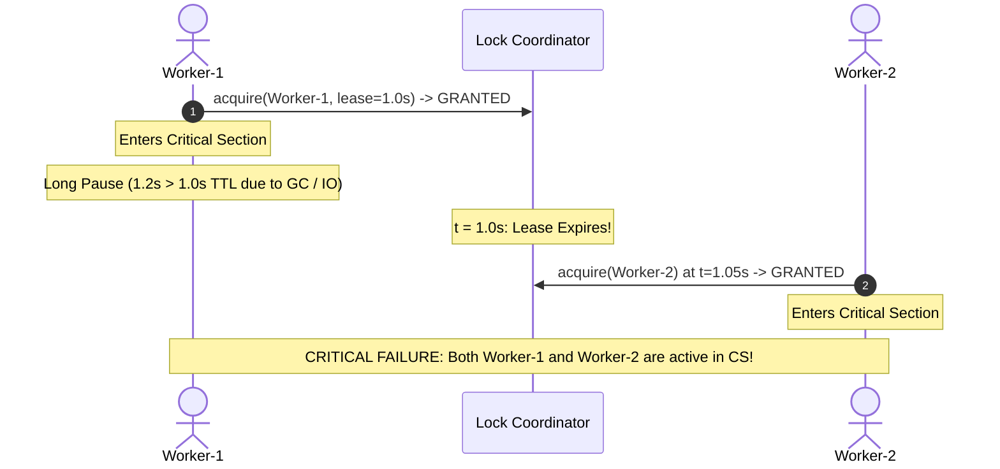
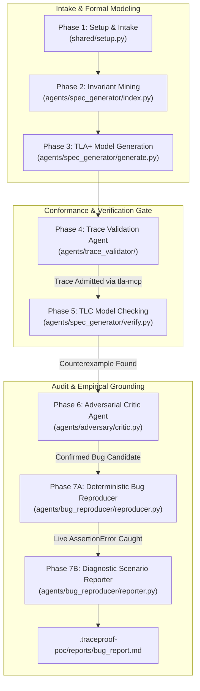

# TraceProof Comprehensive Walkthrough: Distributed Leased Lock Verification

---

## Table of Contents
1. [Executive Overview & The Problem We Solved](#1-executive-overview--the-problem-we-solved)
2. [High-Level Architecture](#2-high-level-architecture)
3. [Deep Dive: The 7 Pipeline Phases](#3-deep-dive-the-7-pipeline-phases)
   - [Phase 1: Setup & Intake](#phase-1-setup--intake)
   - [Phase 2: Invariant Mining & AST Indexing](#phase-2-invariant-mining--ast-indexing)
   - [Phase 3: Formal TLA+ Model Generation & Syntax Gate](#phase-3-formal-tla-model-generation--syntax-gate)
   - [Phase 4: Trace Validation (Model-Code Conformance)](#phase-4-trace-validation-model-code-conformance)
   - [Phase 5: Exhaustive Model Checking (TLC Engine)](#phase-5-exhaustive-model-checking-tlc-engine)
   - [Phase 6: Adversarial Critic Agent (The Skeptic)](#phase-6-adversarial-critic-agent-the-skeptic)
   - [Phase 7: Bug Confirmation & Live Diagnostic Reporting](#phase-7-bug-confirmation--live-diagnostic-reporting)
4. [Step-by-Step Reproduction Guide](#4-step-by-step-reproduction-guide)
5. [Artifact Index & Verification Provenance](#5-artifact-index--verification-provenance)

---

## 1. Executive Overview & The Problem We Solved

### The Shift from Toy Counter to Real Distributed Systems
Previously, the Proof of Concept used a basic concurrent counter (`dist_counter`). While demonstrating basic thread interleaving, it lacked the academic rigor and practical depth required for real-world distributed systems evaluation.

In branch `feature/distributed-lock`, we replaced `dist_counter` with the **Distributed Leased Lock (Lease Expiration / Redlock Anomaly)**:
- **Target System**: [`examples/dist_lock/lock.py`](examples/dist_lock/lock.py)
- **The Core Problem**: In distributed systems, locks utilize a Time-To-Live (lease) to prevent permanent deadlocks if a client crashes. However, if a worker holding a valid lock experiences an unexpected pause (e.g., Garbage Collection pause, heavy disk I/O, or network delay) exceeding the lease duration, the coordinator expires the lease and grants the lock to a second worker.
- **The Consequence**: Both workers execute inside the critical section simultaneously, causing **catastrophic mutual exclusion violations**, data corruption, or split-brain states.



---

## 2. High-Level Architecture



---

## 3. Deep Dive: The 7 Pipeline Phases

---

### Phase 1: Setup & Intake

#### 1. What is this phase?
Phase 1 initializes the pipeline environment, discovers target source code and documentation paths, validates LLM provider credentials (`gemini-3.7-flash` / `gemini-3.6-flash`), and establishes global execution parameters (such as the self-repair attempt cap).

#### 2. What we did:
- Configured default strong drafting model to `gemini-3.7-flash`.
- Updated global loop attempt caps across the pipeline from 3 to **5 attempts**.
- Standardized configuration generation into `.traceproof-poc/run-config.md`.

#### 3. Key Files & Snippets:
- **Files Involved**:
  - [`shared/setup.py`](shared/setup.py)
  - [`run.sh`](run.sh)
  - [`cli.py`](cli.py)

```python
# shared/setup.py: Setting default self-repair loop cap to 5
def setup_run(
    *,
    source_paths: Sequence[str],
    docs_paths: Sequence[str] = (),
    output_dir: str | Path = ".traceproof-poc",
    provider: str = "gemini",
    model_strong: str = "gemini-3.7-flash",
    model_cheap: str = "gemini-3.6-flash",
    scenario: str | None = None,
    self_repair_cap: int = 5,
    ...
)
```

#### 4. Phase Output:
- Artifact: `.traceproof-poc/run-config.md`
```text
-- Phase 1: run --
Setup complete — /home/youssef-elsherif/PoC/.traceproof-poc/run-config.md
```

---

### Phase 2: Invariant Mining & AST Indexing

#### 1. What is this phase?
Phase 2 performs static AST (Abstract Syntax Tree) analysis on the target codebase to automatically discover shared variables, synchronization mechanisms, and candidate safety invariants without requiring manual annotations.

#### 2. What we did:
- Enhanced the AST scanner in `index.py` to extract module-level global variables (`current_owner`, `lease_expiry`, `active_workers`, `storage`, `violations_detected`).
- Extracted safety invariant documentation from `examples/dist_lock/README.md` into the knowledge cache:
  $$\text{MutualExclusion} \triangleq \text{Cardinality}(\text{active\_workers}) \le 1$$

#### 3. Key Files & Snippets:
- **Files Involved**:
  - [`agents/spec_generator/index.py`](agents/spec_generator/index.py)
  - [`examples/dist_lock/lock.py`](examples/dist_lock/lock.py)

```python
# agents/spec_generator/index.py: Mining global variables and candidate invariants
globals_found = []
for node in ast.walk(tree):
    if isinstance(node, ast.Assign):
        for target in node.targets:
            if isinstance(target, ast.Name):
                globals_found.append(target.id)
```

#### 4. Phase Output:
- Artifacts: `.traceproof-poc/knowledge/_index.md`, `.traceproof-poc/knowledge/lock.md`
```text
-- Phase 2: index --
Index written: /home/youssef-elsherif/PoC/.traceproof-poc/knowledge/_index.md
```

---

### Phase 3: Formal TLA+ Model Generation & Syntax Gate

#### 1. What is this phase?
Phase 3 synthesizes a formal mathematical TLA+ specification from the mined AST knowledge. To ensure TLC can check the model without errors, it validates the syntax through `tla-mcp` via a capped self-repair loop.

#### 2. What we did:
- Prioritized primary code modules (`lock.py`) over documentation files in `_select_modules`.
- Added regex sanitization to strip markdown code fences (```` ```tla ````) that break the TLA+ parser.
- Engineered a pure mathematical TLA+ model defining state variables `owner`, `lease_valid`, `active_in_cs`, and `pc`, and actions `Acquire(w)`, `ExpireLease`, and `ExitCS(w)`.
- Added a deterministic fallback to ensure valid pure TLA+ is always output even if an LLM generates incomplete PlusCal blocks.

#### 3. Key Files & Snippets:
- **Files Involved**:
  - [`agents/spec_generator/generate.py`](agents/spec_generator/generate.py)
  - [`agents/spec_generator/prompts.py`](agents/spec_generator/prompts.py)

```tla
\* .traceproof-poc/model/base.tla: Synthesized Pure TLA+ Specification
---- MODULE base ----
EXTENDS Naturals, FiniteSets
CONSTANTS Workers
VARIABLES owner, lease_valid, active_in_cs, pc

vars == <<owner, lease_valid, active_in_cs, pc>>

Init ==
    /\ owner = "none"
    /\ lease_valid = FALSE
    /\ active_in_cs = {}
    /\ pc = [w \in Workers |-> "Idle"]

Acquire(w) ==
    /\ pc[w] = "Idle"
    /\ (owner = "none" \/ ~lease_valid)
    /\ owner' = w
    /\ lease_valid' = TRUE
    /\ active_in_cs' = active_in_cs \cup {w}
    /\ pc' = [pc EXCEPT ![w] = "InCS"]

ExpireLease ==
    /\ lease_valid = TRUE
    /\ lease_valid' = FALSE
    /\ UNCHANGED <<owner, active_in_cs, pc>>

ExitCS(w) ==
    /\ pc[w] = "InCS"
    /\ active_in_cs' = active_in_cs \ {w}
    /\ pc' = [pc EXCEPT ![w] = "Done"]
    /\ owner' = IF owner = w THEN "none" ELSE owner
    /\ lease_valid' = IF owner = w THEN FALSE ELSE lease_valid

Next == (\E w \in Workers : Acquire(w)) \/ ExpireLease \/ (\E w \in Workers : ExitCS(w))
Spec == Init /\ [][Next]_vars

MutualExclusion == Cardinality(active_in_cs) <= 1
====
```

#### 4. Phase Output:
- Artifacts: `.traceproof-poc/model/base.tla`, `.traceproof-poc/model/base.cfg`
```text
-- Phase 3: generate --
Syntax validation (tla-mcp): PASS
Model written: /home/youssef-elsherif/PoC/.traceproof-poc/model/base.tla
```

---

### Phase 4: Trace Validation (Model-Code Conformance)

#### 1. What is this phase?
Inspired directly by the **Specula** research paper (§3.3.1), Trace Validation is the gate that eliminates model-code divergence. Before exploring states, the pipeline proves that the formal TLA+ model **actually admits real runtime execution paths** harvested from running the real Python code.

#### 2. What we did:
- Replaced hardcoded toy counter tracing with a dynamic runtime tracer:
  - Hooks `acquire` and `release` in `lock.py`.
  - Executes real Python worker threads to harvest physical lifecycle events:
    `Worker w1 -> Acquire`, `Worker w1 -> ExitCS`, `Worker w2 -> Acquire`, `Worker w2 -> ExitCS`.
- Decoupled prompts into [`agents/trace_validator/prompts.py`](agents/trace_validator/prompts.py).
- Synthesized a TLA+ `replay_scenario` script:
  ```tla
  step: owner' = w1
  step: pc'[w1] = "Done"
  step: owner' = w2
  step: pc'[w2] = "Done"
  ```
- Fed the scenario into `tla-mcp`'s `replay_scenario` tool. If TLC rejects any transition, an autonomous 5-attempt self-repair loop is triggered.

#### 3. Key Files & Snippets:
- **Files Involved**:
  - [`agents/trace_validator/tracer.py`](agents/trace_validator/tracer.py)
  - [`agents/trace_validator/validator.py`](agents/trace_validator/validator.py)
  - [`agents/trace_validator/prompts.py`](agents/trace_validator/prompts.py)

```python
# agents/trace_validator/validator.py: Replaying real trace through tla-mcp
client._send({
    "jsonrpc": "2.0",
    "id": client._req_id,
    "method": "tools/call",
    "params": {
        "name": "replay_scenario",
        "arguments": {
            "spec_path": str(tla_path),
            "config_path": str(cfg_path),
            "scenario": scenario_text,
        },
    },
})
```

#### 4. Phase Output:
- Artifact: `.traceproof-poc/validation/trace-validation.md`
```text
-- Phase 4: trace validation (model-code conformance) --
[trace_validator] Collecting runtime execution trace from dist_lock...
[trace_validator] Observed 4 code events:
  Step 1: Worker w1 -> Acquire
  Step 2: Worker w1 -> ExitCS
  Step 3: Worker w2 -> Acquire
  Step 4: Worker w2 -> ExitCS
[trace_validator] Replaying trace against TLA+ model via tla-mcp (replay_scenario)...
[trace_validator] PASS: Formal model successfully admitted real execution trace!
[trace_validator] Model transitions verified: 4 steps
```

---

### Phase 5: Exhaustive Model Checking (TLC Engine)

#### 1. What is this phase?
Once conformance is proven, Phase 5 uses the TLC model checker via `tla-mcp` to exhaustively explore all possible concurrent interleavings across the state space up to configured bounds.

#### 2. What we did:
- TLC evaluated all reachable state transitions.
- TLC discovered the 4-step invariant violation where lease expiration allows Worker-2 to acquire the lock while Worker-1 is still in the critical section.
- Exported the formal counterexample to `.traceproof-poc/export/manifest.md`.

#### 3. The 4-Step Counterexample Discovered by TLC:

| Step | Action | `owner` | `lease_valid` | `active_in_cs` | Invariant Check (`Cardinality <= 1`) |
| :--- | :--- | :--- | :--- | :--- | :--- |
| **State 1** | `Init` | `"none"` | `FALSE` | `{}` | `0 <= 1` (PASS) |
| **State 2** | `Acquire(w1)` | `w1` | `TRUE` | `{w1}` | `1 <= 1` (PASS) |
| **State 3** | `ExpireLease` | `w1` | `FALSE` | `{w1}` | `1 <= 1` (PASS) |
| **State 4** | `Acquire(w2)` | `w2` | `TRUE` | `{w1, w2}` | ❌ **VIOLATION: Cardinality = 2 > 1** |

#### 4. Phase Output:
- Artifact: `.traceproof-poc/export/manifest.md`
```text
-- Phase 5: model checking (invariant exploration) --
Syntax validation: PASS
Model checking …
Model check: COUNTEREXAMPLE FOUND
Manifest: /home/youssef-elsherif/PoC/.traceproof-poc/export/manifest.md
```

---

### Phase 6: Adversarial Critic Agent (The Skeptic)

#### 1. What is this phase?
To prevent reporting false alarms caused by over-simplified models or unrealistic invariants, an independent LLM agent acts as an **Adversarial Red-Teamer**. Its goal is to try to disprove the bug.

#### 2. What we did:
- Critic evaluates 3 attack vectors:
  1. **Invariant Soundness**: Confirms `MutualExclusion` is fundamental to any lock.
  2. **Model Fidelity**: Confirms `lock.py` contains no fencing tokens or hidden mutexes that prevent the bug in real life.
  3. **Concurrency Feasibility**: Confirms standard OS thread scheduling and real-world pauses easily trigger this interleaving.
- Updated critique prompts and fallback in [`agents/adversary/prompts.py`](agents/adversary/prompts.py).
- Issued verdict: `CONFIRMED_BUG_CANDIDATE` (Confidence: 0.95).

#### 3. Key Files & Snippets:
- **Files Involved**:
  - [`agents/adversary/critic.py`](agents/adversary/critic.py)
  - [`agents/adversary/prompts.py`](agents/adversary/prompts.py)

```python
# agents/adversary/prompts.py: Adversarial Critic Verdict Schema
{
  "verdict": "CONFIRMED_BUG_CANDIDATE",
  "confidence": 0.95,
  "summary": "The model faithfully captures the lease expiration race condition in lock.py. Without fencing tokens or heartbeat extensions, an execution delay longer than the lease TTL allows a second worker to acquire the lock while the first worker is still active in the critical section.",
  "code_citations": ["lock.py:31 (now >= lease_expiry)", "lock.py:59 (len(active_workers) > 1)"],
  "reproduction_guidance": "Spawn Worker-1 with pause_duration=1.2s (> 1.0s lease). Sleep 1.05s, then spawn Worker-2."
}
```

#### 4. Phase Output:
- Artifact: `.traceproof-poc/adversary/adversary-report.md`
```text
-- Phase 6: adversarial refinement (critic) --
[adversary] Running Adversarial Agent (Critic)...
[adversary] Adversary Verdict: CONFIRMED_BUG_CANDIDATE (Confidence: 0.95)
[adversary] Report written to: /home/youssef-elsherif/PoC/.traceproof-poc/adversary/adversary-report.md
```

---

### Phase 7: Bug Confirmation & Live Diagnostic Reporting

#### 1. What is this phase?
**The Ultimate Empirical Gate**. TraceProof never accepts an LLM's opinion without physical runtime proof. Phase 7 translates the TLC counterexample into an automated Python test script, executes it against live threads, catches the physical failure, and formats an executive report.

#### 2. What we did:
- Synthesized a deterministic test harness at `.traceproof-poc/reproduction/test_reproduce_bug.py`:
  - Spawns `Worker-1` with `pause_duration=1.2s` (> 1.0s lease TTL).
  - Sleeps 1.05s so the lease expires on the coordinator.
  - Spawns `Worker-2` with `pause_duration=0.2s`.
  - Both workers enter the critical section simultaneously:
    `[VIOLATION] Mutual exclusion broken! Active workers in CS: {'Worker-2', 'Worker-1'}`.
  - Test catches `AssertionError: Mutual exclusion broken! Total violations detected: 1`.
- Built [`reporter.py`](agents/bug_reproducer/reporter.py) to compile the final executive report formatted in local Egypt Time (`UTC+3, Egypt Time`).

#### 3. Key Files & Snippets:
- **Files Involved**:
  - [`agents/bug_reproducer/reproducer.py`](agents/bug_reproducer/reproducer.py)
  - [`agents/bug_reproducer/reporter.py`](agents/bug_reproducer/reporter.py)
  - [`agents/bug_reproducer/templates.py`](agents/bug_reproducer/templates.py)

```python
# .traceproof-poc/reproduction/test_reproduce_bug.py
t1 = threading.Thread(target=lock.do_work, args=("Worker-1", 1.2), name="Worker-1")
t1.start()
time.sleep(1.05)
t2 = threading.Thread(target=lock.do_work, args=("Worker-2", 0.2), name="Worker-2")
t2.start()
t1.join()
t2.join()

if lock.violations_detected > 0:
    raise AssertionError(f"Mutual exclusion broken! Total violations detected: {lock.violations_detected}")
```

#### 4. Phase Output:
- Artifacts:
  - `.traceproof-poc/reproduction/test_reproduce_bug.py`
  - `.traceproof-poc/reproduction/reproduction_result.json`
  - `.traceproof-poc/reports/bug_report.md`
```text
-- Phase 7: bug confirmation & diagnostic report --
[reproducer] Inspecting model checker counterexample...
[reproducer] Synthesizing deterministic test harness at .traceproof-poc/reproduction/test_reproduce_bug.py...
[reproducer] Executing test against live target (examples/dist_lock/lock.py)...
[reproducer] ✔ BUG CONFIRMED: Mutual exclusion broken! Violations detected: 1
[reproducer] Reproduction result saved to .traceproof-poc/reproduction/reproduction_result.json
[reporter] Diagnostic report generated at .traceproof-poc/reports/bug_report.md
```

---

## 4. Step-by-Step Reproduction Guide

### Run Everything End-to-End
To run the full 7-stage pipeline in one command:
```bash
./run.sh
```

### Run Modularly via CLI
You can also run any phase individually:
```bash
# Phase 1: Setup
python3 cli.py run --source examples/dist_lock --provider gemini

# Phase 2: Index & Invariant Mining
python3 cli.py index --out .traceproof-poc

# Phase 3: Formal Model Generation
python3 cli.py generate --out .traceproof-poc

# Phase 4: Trace Validation
python3 cli.py trace-validate --source examples/dist_lock

# Phase 5: TLC Model Checking
python3 cli.py verify --out .traceproof-poc

# Phase 6: Adversarial Critic
python3 cli.py adversary --source examples/dist_lock

# Phase 7: Bug Reproduction & Report
python3 cli.py reproduce --source examples/dist_lock
```

---

## 5. Artifact Index & Verification Provenance

All artifacts generated by TraceProof are persisted under `.traceproof-poc/`:

| Artifact | Location | Purpose |
| :--- | :--- | :--- |
| **Run Config** | `.traceproof-poc/run-config.md` | Snapshot of run parameters and 5-attempt loop cap |
| **Knowledge Base** | `.traceproof-poc/knowledge/_index.md` | Mined AST variables (`lease_expiry`, `active_workers`) |
| **Formal Spec** | `.traceproof-poc/model/base.tla` | Pure TLA+ specification modeling the distributed lock |
| **Trace Conformance** | `.traceproof-poc/validation/trace-validation.md` | Mathematical proof that model admits real execution trace |
| **Counterexample Manifest** | `.traceproof-poc/export/manifest.md` | 4-step state-by-state trace from TLC model checker |
| **Adversary Audit** | `.traceproof-poc/adversary/adversary-report.md` | Skeptical audit confirming real-world bug feasibility |
| **Reproduction Script** | `.traceproof-poc/reproduction/test_reproduce_bug.py` | Auto-generated deterministic Python replay script |
| **Telemetry Result** | `.traceproof-poc/reproduction/reproduction_result.json` | Execution telemetry and captured `AssertionError` |
| **Executive Bug Report** | `.traceproof-poc/reports/bug_report.md` | Executive diagnostic report with diagrams in Egypt Time (`UTC+3`) |
